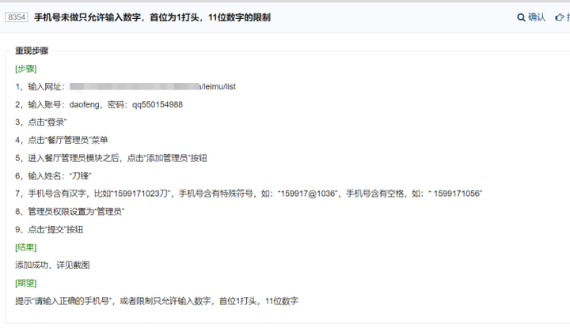

#### 提单的意义是什么？

主要有以下几个目的：

1. 记录对应的问题，避免因为没有对应的记录过程而导致开发漏修复和测试人员漏测
2. 阐述对应的问题出现的操作步骤
3. 让整个问题从提出到修改，到解决形成一个闭环，毕竟bug的过程有可能会有不同的流程走向

#### 提单走向

1. 测试人员发现bug提交给开发
2. 开发人员判断是否是bug
3. 如果是bug，进行修改，修改完成之后更改bug状态为已解决
4. 如果不是bug，退回给测试人员并描述退回原因，例如：设计如此，或为外部原因，或者不能重现。
5. 开发人员修改完成的bug，由测试人员进行验证，确认修改正确，关闭bug。
6. 验证未通过的bug重新激活，开发人员继续修改，直至验证通过，关闭bug。
7. 测试人员需要对开发人员退回的bug进行确认
8. 确认不是bug关闭
9. 如与开发人员意见不一致，认为是bug，需提交项目负责人仲裁。
10. 项目负责人确认是bug由开发人员修改，不是bug由测试人员关闭

 