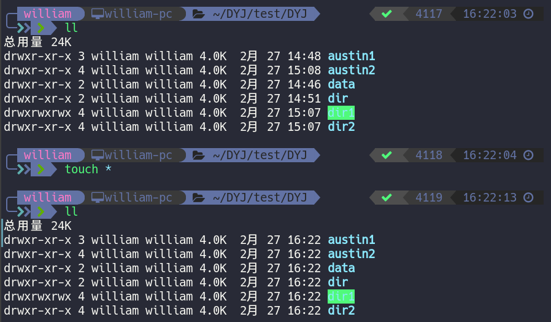
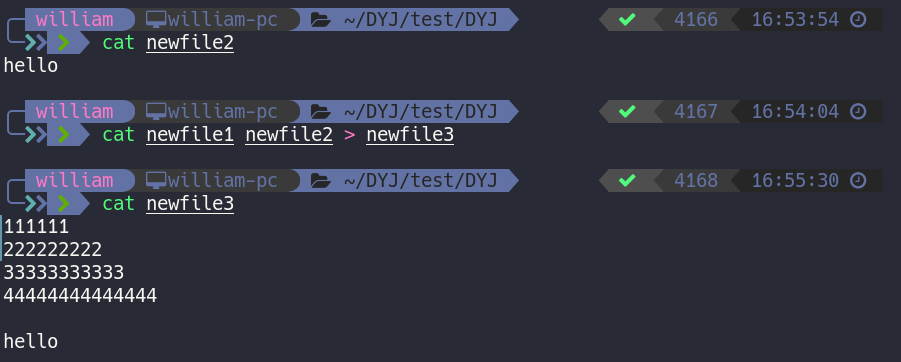
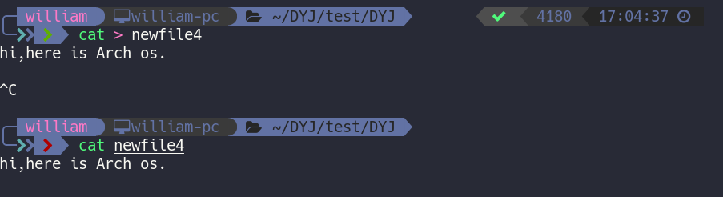

## Linux命令

### 1. cd

 1. 进入家目录（cd ~），直接cd也行

    

 2. 进入系统/etc目录（cd /etc）

    

	3. 切换到当前目录的上一级目录（cd ..）

    

 4. 进入当前目录的父目录的父目录（cd ../../）

    

	5. 返回当前用户上一次所在的目录（cd -）

    

    

### 2. pwd（print working directory）显示当前工作目录的绝对路径

​	**pwd **

### 3. ls（list directory contents）列出目录的内容及其内容属性信息

​	**ls [-latdhurR] [file]**

1. ls -a 显示所有文件，ls -A 不显示..和.目录

   

2. `ls -l` 以长格式列出文件及目录信息，缩写`ll`

   

   `drwxr-xr-x 3 william william 4096  2月 27 14:47 austin`

   - 1位：字符文件类型，“d”目录，“-”普通文件，“l”链接文件，“c”设备文件，“p”命令管道文件，“s”sock文件，与shell编程有关文件
   - 2-4位：r表是读 (Read)  4、w表示写 (Write)  2、x表示执行 (eXecute) 1
   - 5-7位：改文件/目录所属用户组的权限
   - 8-10位：其他用户权限
   - *3* 硬链接个数。新建一个空目录，这个目录的第二字段就是2，表示该目录下有两个子目录。**每一个目录都有一个指向它本身的子目录。**
   - *william*文件的拥有者
   - *william*文件拥有者所在组
   - *4.0K*文件所占用的空间。**请注意是文件夹本身的大小，而不是文件夹以及它下面的文件的总大小**
   - *2月 27 14:47*文件最近访问（修改）的时间
   - *austin*文件名

3. `ls -d` 只显示目录本身的信息，与l连用

   

4. `ls -R`递归查看目录，感觉没tree好用

   

5. `ls -t`根据最后修改时间排序

   

6. `ls -r`反向排序

   

7. `ls -h` 以人类可读的信息展示文件大小

   

8. `ls -u` 最后访问时间排序

   

### 4. mkdir（make directories）创建目录，如果要创建的目录已存在，则会提示此文件已存在；而不会继续创建目录

​	**mkdir [-pmv] directory**

1. mkdir -p
   - 递归创建目录
   - 即使创建的目录已经存在也不会报错
   
   
   
2. mkdir -m
   
   - 设置新创建目录的默认目录对应的权限
   
   
   
3. mkdir -v
   
   - 显示创建目录的过程
   
   
   
4. 同时创建多个目录及多级子目录

   

### 5. rmdir（remove empty directories）删除空目录，当目录不为空，命令不起作用

​	**rmdir [-pv] directory**

1. rmdir -p 递归删除目录，当子目录删除后空父目录为空，一并删除。

2. rmdir -v 显示执行过程

   

### 6. touch

​	touch [**-acm**] [**-t** *time*] *file*

1. `touch *`

   

   将目录中所有文件修改成相同时间和日期

2. `touch -m`

   只修改时间`touch -m -t 08311729 file1`(-t 具体时间日期)

   

3. `touch -a`

   只修改访问时间`touch -a -t 200812211030 file2`

4. `touch newfile`

   创建多文件`touch newfile1 newfile2 newfile3 temp`

   

5. `touch -c(not create) file`

   更新访问时间不创建新文件`touch -c newfile1 newfile2 newfile3 temp`

   

### 7. cat

1. 查看文件

   

2. 把多个文件合并成一个

   

3. 追加内容到文件尾

   

4. 文件内容清空

   

5. 编辑新文件，旧文件覆盖哦

   

   **cat [-nbs] file** 

- `cat -n` 显示行号

  

- `cat -b` 不对空行编号

  

- `cat -s` 把两个以上的空行变成一个空行

  

