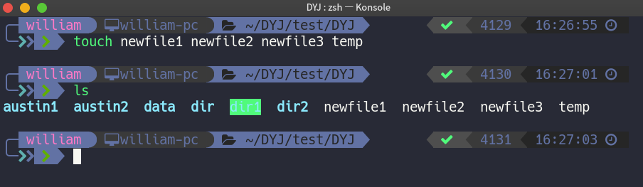
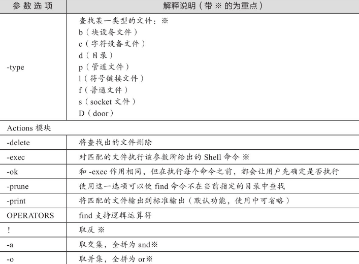
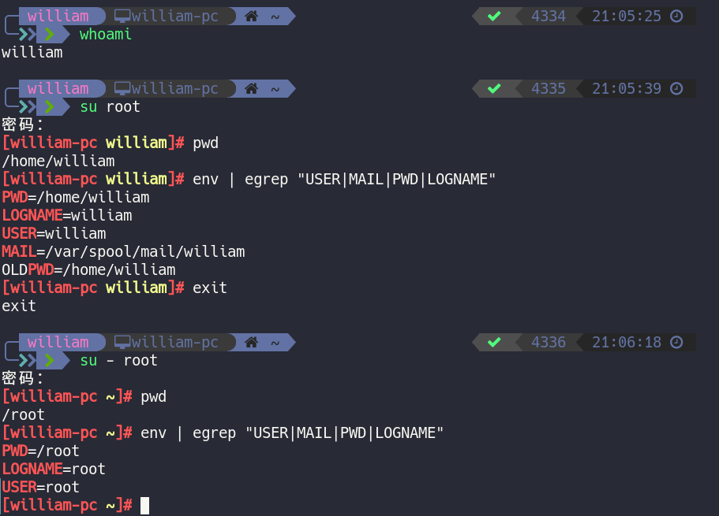

## Linux命令

### 1. cd

cd（change directory）

 1. 进入家目录（cd ~），直接cd也行

    

 2. 进入系统/etc目录（cd /etc）

    

3. 切换到当前目录的上一级目录（cd ..）

   

 4. 进入当前目录的父目录的父目录（cd ../../）

    

5. 返回当前用户上一次所在的目录（cd -）

   

   

### 2. pwd

	pwd （print working directory）显示当前工作目录的绝对路径


### 3. ls

ls （list directory contents）列出目录的内容及其内容属性信息


	ls [-latdhurR] [file]

1. ls -a 显示所有文件，ls -A 不显示..和.目录

   

2. `ls -l` 以长格式列出文件及目录信息，缩写`ll`

   

   `drwxr-xr-x 3 william william 4096  2月 27 14:47 austin`

   - 1位：字符文件类型，“d”目录，“-”普通文件，“l”链接文件，“c”设备文件，“p”命令管道文件，“s”sock文件，与shell编程有关文件
   - 2-4位：r表是读 (Read)  4、w表示写 (Write)  2、x表示执行 (eXecute) 1
   - 5-7位：改文件/目录所属用户组的权限
   - 8-10位：其他用户权限
   - *3* 硬链接个数。新建一个空目录，这个目录的第二字段就是2，表示该目录下有两个子目录。**每一个目录都有一个指向它本身的子目录。**
   - *william*文件的拥有者
   - *william*文件拥有者所在组
   - *4.0K*文件所占用的空间。**请注意是文件夹本身的大小，而不是文件夹以及它下面的文件的总大小**
   - *2月 27 14:47*文件最近访问（修改）的时间
   - *austin*文件名

3. `ls -d` 只显示目录本身的信息，与l连用

   

4. `ls -R`递归查看目录，感觉没tree好用

   

5. `ls -t`根据最后修改时间排序

   

6. `ls -r`反向排序

   

7. `ls -h` 以人类可读的信息展示文件大小

   

8. `ls -u` 最后访问时间排序

   

### 4. mkdir

mkdir （make directories）创建目录，如果要创建的目录已存在，则会提示此文件已存在；而不会继续创建目录


	mkdir [-pmv] directory

1. mkdir -p

   - 递归创建目录
   - 即使创建的目录已经存在也不会报错

   

2. mkdir -m

   - 设置新创建目录的默认目录对应的权限

   

3. mkdir -v

   - 显示创建目录的过程

   

4. 同时创建多个目录及多级子目录

   

### 5. rmdir

	rmdir （remove empty directories）删除空目录，当目录不为空，命令不起作用
	
	rmdir [-pv] directory

1. rmdir -p 递归删除目录，当子目录删除后空父目录为空，一并删除。

2. rmdir -v 显示执行过程

   

### 6. touch

	touch [-acm] [-t time] file

1. `touch *`

   

   将目录中所有文件修改成相同时间和日期

2. `touch -m`

   只修改时间`touch -m -t 08311729 file1`(-t 具体时间日期)

   

3. <font color="red">`touch -a`</font>

   只修改访问时间`touch -a -t 200812211030 file2`

4. `touch newfile`

   创建多文件`touch newfile1 newfile2 newfile3 temp`

   

5. `touch -c(not create) file`

   更新访问时间不创建新文件`touch -c newfile1 newfile2 newfile3 temp`

   

### 7. cat

1. 查看文件

   

2. 把多个文件合并成一个

   

3. 追加内容到文件尾

   

4. 文件内容清空

   

5. 编辑新文件，旧文件覆盖哦

   

   **cat [-nbs] file** 

- `cat -n` 显示行号

  

- `cat -b` 不对空行编号

  

- `cat -s` 把两个以上的空行变成一个空行

  

### 8. cp

	cp命令可以理解为英文单词copy的缩写，其功能为复制文件或目录
	
	cp [-pdrai] [source] [dest]

- `cp -p` 复制文件时保持源文件的所有者、权限信息以及时间属性

- `cp -d`如果复制的源文件是符号文件，那么仅复制符号连接本身，而且保留符号链接所指向的目标文件或目录

- `cp -r` 递归复制目录，即复制目录下所有层级的子目录及文件

  

- `cp -a` 等同于`p d r`三条功能命令总和

  

- `cp -i` 覆盖已有文件前提示用户确认

  

### 9. mv

	mv命令可以理解为英文单词move的缩写，其功能是移动或重命名文件（move/rename files）

​	**mv [-fin] [source] [dest]**

- `mv -f` 若目标文件已经存在，则不会询问而是直接覆盖

  

- `mv -i` 若目标文件已经存在，则会询问是否覆盖

  

- `mv -n` 不覆盖已存在的文件

  

### 10. tar

	在Linux系统里，tar是将多个文件打包在一起，并且可以实现解压打包的文件的命令。是系统管理员最常用的命令之一，tar命令不但可以实现对多个文件进行打包，还可以对多个文件打包后进行压缩。打包是指将一大堆文件或目录变成一个总的文件，压缩则是将一个大的文件通过一些压缩算法变成一个小文件。

​	**tar [option] [file]**	


- `tar -zcvf` 打包文件

  

- `tar -ztvf` 查看压缩包内的内容**(不解压)**，v显示文件属性

  

- `tar -zxvf filename.tar.gz -C path` 选项C指定解压路径，若不加C则解压到当前路径

  

  

- `tar zcvf filename.tar.gz path` 压缩路径下的文件

  

- `tar zcvf filename.tar.gz --exclude=PATTERN path` **PATTERN后不要加/** 排除打包

  

- `tar zcvfX filename.tar.gz excludefile path` 排除多个文件打包

  

### 11. grep

	grep命令是Linux系统中最重要的命令之一，其功能是从文本文件或管道数据流中筛选匹配的行及数据，如果再配和正则表达式的技术一起使用，则功能更加强大，它是Linux运维人员必须要掌握的命令之一！

​	**grep [-vnicEwo] [PATTERN] file**


- `grep -v [PATTERN] file`显示不匹配的行，显示不包含匹配文本的所有行

  

  

- `grep -n [PATTERN] file` 使用grep命令显示过滤后的内容的行号

  

- `grep -i [PATTERN] file` 不区分大小写

  

- `grep -c [PATTERN] file`  计算匹配的字符串的数量**（按行字符串匹配第一个）**

  

- `grep -w [PATTERN] file` 搜索关键字的字符串

  

### 12. find

	find命令用于查找目录下的文件，同时也可以调用其他命令执行相应的操作。

​	**find [-H] [-L] [-P] [-D debugopts] [-Olevel] [pathname] [expression]**	


命令参数




- `find path -atime tests`查找指定时间内修改过的文件 ( 距现在2天 ) 

  

  find时间查找说明

  

  ·-4表示文件更改时间距现在4天以内。

  ·+4表示文件更改时间距现在4天以前。

  ·4表示距现在第4天。

- `find -name` 用-name指定关键字查找

  

- `find -!` 取反，不是目录的文件

  

### 13. tail

​	tail命令用于显示文件内容的尾部，它默认输出文件的最后10行

​	**tail [option] [file]**

​	如果指定了多于一个文件，则在每一段输出前会给出文件名作为文件头

- `tail file` 显示文件后10行

  

- `tail -5 file` 显示文件后5行

  

- `tail -f file` 监控日志文件

### 14. useradd

​	useradd命令可用于创建新的用户或者更改用户的信息。

​	**useradd [options] [login]**

​	在使用useradd命令时，若不加任何参数选项，后面直接跟所添加的用户名，那么系统首先会读取/etc/login.defs（用户定义文件）和/etc/default/useradd（用户默认配置文件）文件中所定义的参数和规则，然后根据所设置的规则添加用户，同时还会向/etc/passwd（用户文件）和/etc/group（组文件）文件内添加新用户和新用户组记录，向/etc/shadow（用户密码文件）和/etc/gshadow（组密码文件）文件里添加新用户和组对应的密码信息的相关记录。同时系统还会根据/etc/default/useradd文件所配置的信息建立用户的家目录，并将/etc/skel中的所有文件（包括隐藏的环境配置文件）都复制到新用户的家目录中。

​	

​	useradd加-D选项参数说明：改变新建用户的预设值

​	当执行useradd带-D参数时，可以更改新建用户的默认配置值（/etc/default/useradd）或者由命令行编辑文件更改预设值。可简单理解该参数（-D）就是用于修改/etc/default/useradd配置文件的内容的，若这个文件的内容被修改，则添加新用户不加参数时默认值就会从该/etc/default/useradd中读取。

​	

- `useradd username` 不加任何参数添加用户

  

  创建用户的同时还会创建一个与用户名相同的用户组

  <br>

  下面再来查看/etc/passwd文件中有关新用户austin的记录

  

  这里的1175:1175就是根据/etc/login.defs内容预设的
  
  接下来，我们再看看/etc/shadow、/etc/group和/etc/gshadow文件，是不是也存在与austin用户有关的记录
  
  
  
  虽然没有创建密码但是密码文件还是添加了一行信息
  
  
  
  创建用户时，默认创建与用户同名的用户组，并体现在用户组配置文件中
  
  
  
  组密码文件中也会有一行相关记录
  
  根据上文的结果，我们将会发现/etc/shadow、/etc/group和/etc/gshadow几个文件都存在与austin用户相关的记录


### 15. chown

​	chown命令用于改变文件或目录的用户和用户组

​	**chown [option] [OWNER] [:[GROUP]] file**

```
chown 用户	文件或目录	#仅仅授权用户
chown :组	文件或目录	#仅仅授权组
chown 用户:组	文件或目录	#表示授权用户和组
“:”可与用“.”代替
```

- `chown user file`更改用户所属的用户属性

  

- `chown .group file` 更改文件所属的组属性

  

  **用 " . " 代替 " : " **

- `chown user:group file` 同时更改用户和组属性（使用"."也可以）

  


### 16. ps

​	ps命令用于列出执行ps命令的那个时刻的进程快照，就像用手机给进程照了一张照片。如果想要动态地显示进程的信息，就需要使用top命令，该命令类似于把手机切换成录像模式。

​	**ps [option]**


- `ps`命令不接任何参数

  

  默认情况下，ps命令不接任何参数时，输出的是使用者当前所在终端（窗口）的进程，其输出结果中的各项说明如下。

  ·PID是进程的标识号。

  ·TTY是进程所属的终端控制台。

  ·TIME列是进程所使用的总的CPU时间。

  ·CMD列是正在执行的命令行。

- `ps-ef` -e 显示所有进程，-f 格外显示UID、PPID、C与STIME

  

  输出信息中各列的说明如下。

  ·UID：进程被该UID所拥有。

  ·PID：进程的标识号。

  ·PPID：进程的父进程的标识号。

  ·C：CPU使用的资源百分比。

  ·STIME：进程开始的时间。

  ·TTY：该进程是在哪个终端机上面运作，若与终端机无关，则显示“?”，另外，tty1-tty6是本机上面的登入者进程，若为pts/0等，则表示为由网络连接进主机的进程。

  ·TIME：进程所使用的总的CPU时间。

  ·CMD：正在执行的命令行。

- `ps -ef |grep name` ps与grep的组合用法，用于查找特定进程

  

- `ps -u root` 显示示指定用户的相关进程信息

  

### 17. kill

​	kill命令能够终止你希望停止的进程。

​	**kill [-lps] [pid]**

- `kill -l` 列出所有信号的名称

  

  

- `kill -s` 指定要发送的信号

  

- `kill -9 PID`  KILL（9）信号强制终止进程

  

### 18. top

​	实时显示系统中各个进程的资源占用状况	

​	第一行，任务队列信息，同uptime命令的执行结果。

​	·23：43：57 当前系统时间。

​	·up 5:13 系统已经运行了0天5小时13分。

​	·4 users 当前有4个用户登录系统。

​	·load average：1.75，1.92，1.87 load average后面的三个数分别是1分钟、5分钟、15分钟的平均负载情况。

​	第二行，Tasks为任务（进程）。从上面的信息可以看出，系统现在共有310个进程，其中处于运行状态的有3个，307个在休眠（sleep），stoped状态0个，zombie状态（僵死）的有0个。

​	第三行，CPU状态信息。

​	·5.8% us 用户空间占用CPU的百分比。

​	·5.9% sy 内核空间占用CPU的百分比。·

​	.0.2% ni 改变过优先级的进程占用CPU的百分比。·

​	.86.8% id 空闲CPU百分比。

​	·0.2% wa I/O等待占用CPU的百分比。

​	·0.8% hi 硬中断（Hardware IRQ）占用CPU的百分比

​	·0.3% si 软中断（Software Interrupts）占用CPU的百分比。

​	·0.3%st 虚拟机占用CPU的百分比。

​	第四行，内存状态。

​	·15891.8M total 物理内存总量。

​	·6705.0M used 使用中的内存总量。

​	·1218.8M free 空闲内存总量。

​	·7968.0M buffers 缓冲的内存量。

​	第五行，swap交换分区信息。

​	·17480.9M total 交换区总量。

​	·0.0M used 使用的交换区总量。

​	·17480.9M free 空闲交换区总量。

​	·7968.0M cached 缓存的内存量。

- 按数字“1”，显示每个逻辑CPU状况

  

### 19.free

​	free命令用于显示系统内存状态，具体包括系统物理内存、虚拟内存、共享内存和系统缓存等

​	**free [option]**


- `free -m` 以MB为单位显示内存使用情况

  

- `free -h` 根据实际大小自动转换成KB、MB、GB单位

  

  ·Linux系统的特性是将不用的物理内存缓存起来，因此327MB不是系统的真实剩余内存。

  ·系统真正可用的内存为390MB。

  ·buffers为写入数据缓冲区。

  ·cache为读取数据的缓存区。

### 20. netstat

​	netstat命令用于显示本机网络的连接状态、运行端口和路由表等信息。

​	**netstat [option]**


- `netstat-an` 显示所有连接信息

  

  “Active Internet connections （servers and established）活动的TCP/IP网络连接”

  

  “Active UNIX domain sockets （servers and established）活动的unix socket连接”

  **Proto：**socket使用的协议（TCP、UDP、RAW）

  **Recv-Q：**接收到但是还未处理的字节数

  **Send-Q：**已经发送但是未被远程主机确认收到的字节数

  **Local Address：**本地主机地址和端口

  **Foreign Address：**远程主机地址和端口

  **State：**socket的状态，通常仅仅有TCP的状态，状态值可能有ESTABLISHED、SYN_SENT、SYN_RECV、FIN_WAIT1、FIN_WAIT2、TIME_WAIT等

  

- `netstat -lntup` 显示所有TCP和UDP正在监听的连接信息

  

### 21. su

​	su命令用于将当前用户切换到指定用户或者以指定用户的身份执行命令或程序。

​	**su [option] [user]**

​	从root用户切换到普通用户时，不需要任何密码；从普通用户切换到root用户时，需要输入root密码。

- `su - user` **-, -l, --login 切换用户的同时，将用户的家目录、系统环境等重新按切换后的用户初始化**

  

- `su -c user` 向Shell传递单个命令

### 22. echo

​	echo命令能将指定的文本显示在Linux命令行上

​	**echo [option] [string]**

- `echo -n string` 不换行输出

  

### 23. rm

​	rm命令可以理解为英文单词remove的缩写，其功能是删除一个或多个文件或目录（remove files or directories）。

​	这是Linux系统里最危险的命令之一，请慎重使用。

​	**rm [-rf] [file]**

​	

### 24. shutdown

​	shutdown是一个用来安全关闭或重启Linux系统的命令，系统在关闭之前会通知所有的登录用户，系统即将关闭，此时所有的新用户都不可以登录，与shutdown功能类似的命令还有init、halt、poweroff、reboot

​	**shutdown [option].. TIME [MESSAGE]**

​	

### 25. reboot / halt / poweroff

​	halt、poweroff、reboot这三个命令对应的都是同一个man帮助文档，而halt和poweroff命令是reboot命令的链接文件

​	**reboot [option]**

​	**halt [option]**

​	**poweroff [option]**

​	

### 26. du

​	du命令可以用于统计磁盘空间的使用情况，这个命令有助于我们找出哪个文件过多地占用了磁盘空间

​	**du [option] [file]**

- `du -a file` 通过参数-a显示所有目录或文件所占空间

  

- `du -sh file` 显示指定目录文件大小

  

### 27. df

​	显示文件系统磁盘空间的使用情况

​	**df [option] [file]**


- `df` 显示磁盘的使用情况

  

- `df -ih` 参数-i显示inode的使用情况

  


###  vi / vim

​	**vim [option] [file]**

	vi是Linux命令行界面下的文字编辑器，几乎所有的Linux系统都安装了vi，只要学会了vi这个编辑工具，就可以在任何Linux系统上使用它。而vim是vi命令的增强版（Vi IMproved），与vi编辑器完全兼容，此外还有很多增强功能，例如用不同颜色高亮显示代码。因此，如果系统有vim命令，那么建议大家就使用vim编辑文本。
	
	一般来说，vim可分为三种模式：普通模式、编辑模式、命令模式。这三种模式的作用分别如下。
	
	（1）普通模式用vim命令打开一个文件，默认的状态就是普通模式。在这个模式中，不能进行编辑输入操作，但可以按“上下左右”键来移动光标，也可以执行一些操作命令进行如删除、复制、粘贴等之类的工作。
	
	（2）编辑模式在普通模式下不能进行编辑输入操作，只有按下“i，I，o，O，a，A，r，R，s，S”（其中“I”最常用）等字母进入编辑模式之后才可以执行录入文字等编辑操作。看文件是否处于编辑模式状态有一个重要的特征，那就是在窗口的左下角要有插入的标记“--INSERT--”或“--插入--”
	
	（3）命令模式在普通模式下，输入“：”或“/”或“?”时，光标会自动定位在那一行，在这个模式中，可以执行保存、退出、搜索、替换、显示行号等相关操作。


<center>vim命令的参数选项及说明</center>


