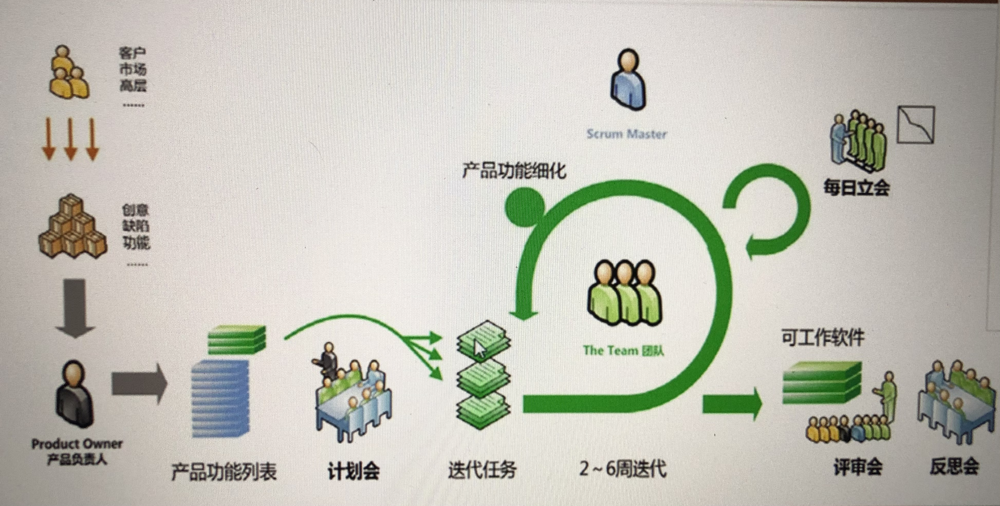
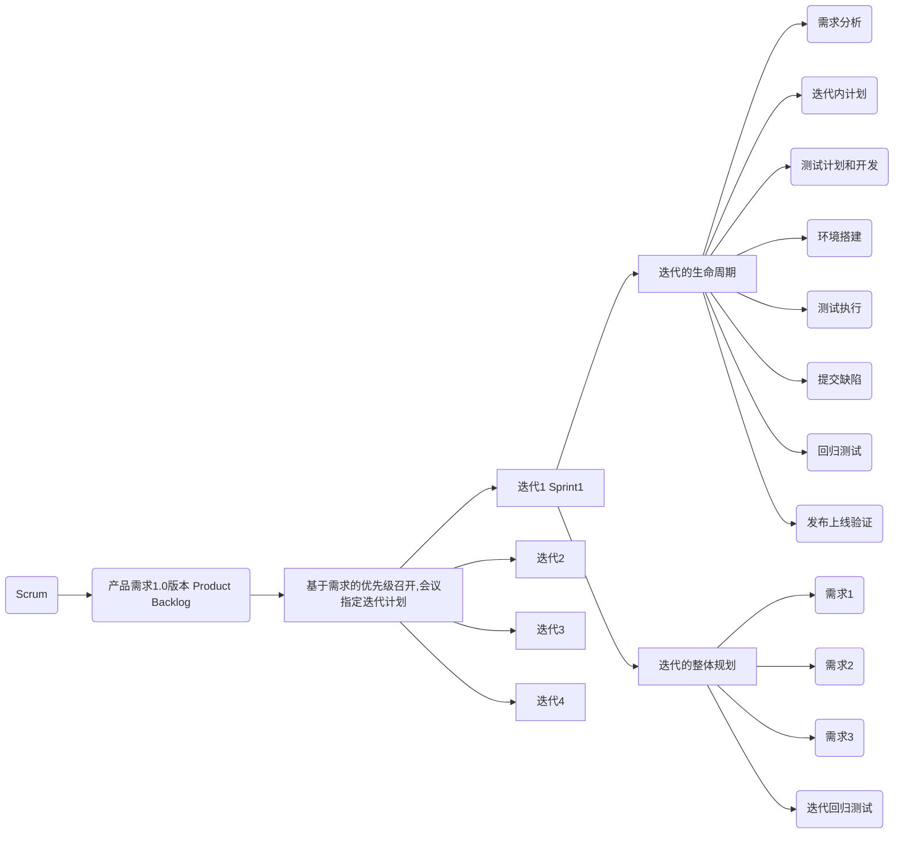

### 什么是敏捷开发

敏捷开发（Agile Development）是一种以人为核心、迭代、循序渐进的开发方法。

它采用迭代时开发，开发方式的主要驱动核心是人。指导我们用规定的环节一步一步完成项目的开发

### 敏捷测试常见术语

- Scrum：敏捷研发的框架

- Sprint：原意为冲刺，Scrum中的Sprint无对应中文翻译，指一个迭代

- Scrum Master：敏捷专家，敏捷研发总负责人

  敏捷专家以各种方式服务于产品负责人**（让大家按照敏捷的方式去研发，引导项目成为敏捷开发模式）**

  以各种方式服务于Scrum团队

  **保证项目按照敏捷的方式去开展，中间环节落实不到位，要各种方式调动大家积极**

- Product Owner：产品负责人简称PO

  产品负责人负责最大化产品以及开发团队工作的价值。实现这一点的方式会随着组织、Scrum团队以及单个团队成员的不同而不同（如果需求烂，没有好的想法。即便高质量完成任务，没有新思想和新功能，也会被淘汰。产品很重要）

- Scrum Team：敏捷研发团队

  开发团队包含了专业人员，负责在每个Sprint的结尾交付潜在可发布的“完成”产品增量。只有开发团队的成员才能创造增量。

  开发团体由组织构建并授权，来组织和管理他们的工作。所产生的协同工作能最大化，开发团队的整体效率和效力。

  **要求：每一个迭代都能交付，可以量化的、可以给客户去展示的交付件。短平快的方式去交付**

- Product Backlog：产品待办列表，指需求清单

- Sprint Backlog：Sprint待办列表，指Sprint任务清单

- Daily Scrum Meeting：每日站会

- Sprint Review Meeting：Sprint评审会议

- User Story：用户故事，指一条需求

### Scrum详细解释

Scrum是一个用于开发和维持复杂产品的框架（6个月及以上的项目），是一个增量、迭代的开发过程。在这个框架中，整个开发过程由若干个短的迭代周期组成，一个短的迭代周期称为一个Sprint，每个Sprint的建议长度为2到4周。在Scrum中，使用产品Backlog来管理产品的需求，产品Backlog是一个按照商业价值排序的需求列表，列表条目的体现形式通常为用户story。Scrum团队总是先开发对客户具有较高价值的需求。在Sprint中，Scrum团队从产品Backlog中挑选最高优先级的需求进行开发。挑选的需求在Sprint计划会议上经过讨论、分析和估算（最长的迭代6周，不能再拆分）得到相应的任务列表，我们称它为Sprint Backlog。在每个迭代结束时，Scrum团队将递交潜在可交付的产品增量。Scrum起源于软件开发项目，但它适用于任何复杂的或是创新性的项目。

### [敏捷软件开发宣言](http://agilemanifesto.org/)

- 个体和互动高于流程和工具（Individuals and interactions over processes and tools）
- 工作的软件高于详尽的文档（Working software over comprehensive documentation）
- 客户合作高于合同谈判（Customer collaboration over contract negotiation）
- 响应变化高于遵循计划（Responding to change over following a plan）

### 敏捷开发全局流程

1. 客户、市场、高层为软件开发提供创意（前瞻性想法）、缺陷（用户反馈不好用、有缺陷的地方）、新功能（直播带货）

2. 产品负责人（Product Owner）汇总成产品功能列表，然后召开迭代拆分会（参会人员至少测试组长起步），讨论出迭代任务

3. 开始正常迭代。

   迭代1：测试做迭代任务的需求评审、测试计划、编写测试用例、执行用例、提交bug、回归测试、发布上线。

   迭代2：

   迭代3：

   ...

   每一天都会开站立会议，最终交付用户可使用的软件

4. 贯穿迭代的评审会、反思会（每次迭代后，都会开）

5. 敏捷专家：辐射全局、观察每一个环节是否按照正常的方式去运作、开展。（框架的监督者）

### Scrum的常见活动

- 产品待办事项列表梳理

  产品待办事项通常会很大，也很宽泛，而且想法会变来变去、优先级也会变化，所以产品待办事项梳理是一个贯穿整个Scrum项目始终的活动。该活动包含但不限于以下内容：

  1. 保持产品待办事项列表有序（列出待办优先级）
  2. 把看起来不再重要的事项移除或者降级（及时更新维护，不重要的移除或降级）
  3. 增加或提升涌现出来的或变得更重要的事项（重要的事项提高优先级）
  4. 将事项分解成更小的事项（大的事项分解成若干个小的事项）
  5. 将事项并归为更大的事项（小事项合并成大的事项）
  6. 对事项进行估算（对事项时间进行估算）

- 产品待办事项列表梳理的一个最大的好处，是为即将到来的几个Sprint做准备。为此，梳理时会特别关注那些即将被实现的事项。

### 迭代计划（拆分）会议

基于列好的产品需求，进行迭代的拆分

[参考文章末尾图]

1. 会给出2-3个迭代的相对明确的任务，3个迭代后的项目变动会大很多。
2. 依赖于需求清单（优先级、客户需求大、估时），拼凑到一个项目里。
3. 征求开发经理、测试组长的意见

### Scrum 看板

| 待办 | 处理中 | 完成 |
| ---- | ------ | ---- |
|      |        |      |

开发、测试人员都可以写

​	**通过看板清晰看到个人、团队工作的进度。**

### 每日站会

- 每日站立会议是敏捷流程Scrum中的很重要的一个制度之一。
- 功能
  - 快速同步，让项目组内部的员工互相了解彼此的进展，从而了解项目的整体进展
  - 给每个人一种精神压力，信守承诺。这是一种面对面的精神压力，直面项目进展。
  - 培养团队的文化，让每个人意识到，我不是一个人在战斗，我们是一个团队
- 站立会议的目的
  - 让所有人了解其他人在做什么，当前项目计划进展如何
  - 帮助大家解决哪些阻碍、做事情的问题，以及共享承诺。这些都非常有利于提高团队合作精神。

开会人员：负责相同模块的产品经理、开发、测试

开会人数：10人以内

开会时间：10分钟左右

会议内容：1.昨天做了什么。2.今天打算做什么。3.昨天工作遇到的没解决的问题。或者遇到什么问题解决了，可以给大家参考。

### Scrum迭代回顾会议

在每个Sprint结束后，Scrum团队会聚在一起开Sprint回顾会议

- 目的：回顾以下团队在流程、人际关系以及工具方面做的如何

- 团队识别出哪些做的好的，哪些做的不好的。并找出潜在的改进事项，为将来的改进制定计划。

- 所有的Scrum会议都是限定时长的，Sprint回顾会议的推荐时长是Sprint中的每一周对应一个小时

  （一个Sprint包含2个星期，则Sprint回顾会议时长为2小时）

- Scrum团队总是在Scrum的框架内，改进他们自己的流程。

回归

1. 迭代内bug和需求的回归

2. 上线前整体的回归

3. 迭代与迭代版本是否有影响

