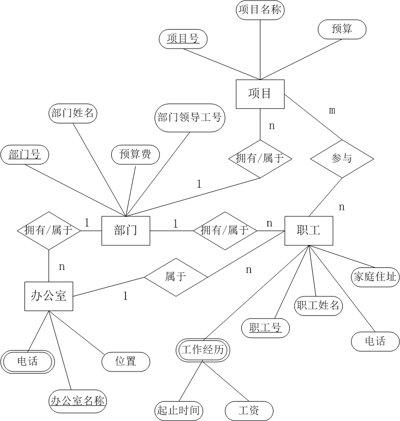
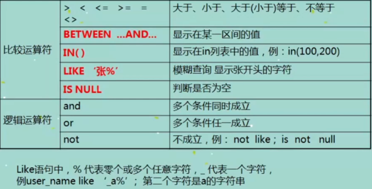

## MySQL

### 什么是数据库

DB（data base），实际上是一个文件合集，是一个存储数据的仓库，本质是一个文件系统，数据库是按照特定格式把数据存储起来，用户可以对存储的数据进行增删改查操作

数据库分类：

- 关系型数据库：建立在关系模型基础上的数据库

  MySQL、Oracle、DB2、SQL Server、PostgreSQL

- 非关系型数据库：通常指数据之间无关系的数据库（NO SQL）

  MongoDB、Redis、Cassandra

### ER图

1. **ER图的实体（entity）**即数据模型中的数据对象，例如人、学生、音乐都可以作为一个数据对象，用**长方体**来表示，每个实体都有自己的实体成员（entity member）或者说实体对象（entity instance），例如学生实体里包括张三、李四等，实体成员（entity member）不需要出现在ER图中。

2. **ER图的属性（attribute）**即数据对象所具有的属性（所具有的列），例如学生具有姓名、学号、年级等属性，用**椭圆形**表示，属性分为唯一属性（unique attribute）和非唯一属性，唯一属性（主键）指的是唯一可用来标识该实体实例或者成员的属性，用下划线表示，一般来讲实体都至少有一个唯一属性。

3. **ER图的关系/联系（relationship）**用来表现数据对象与数据对象之间的联系，例如学生的实体和成绩表的实体之间有一定的联系，每个学生都有自己的成绩表，这就是一种关系，关系用**菱形**来表示。

4. **ER图**中关联关系有三种：

- **1对1（1:1）** ：1对1关系是指对于实体集A与实体集B，A中的每一个实体至多与B中一个实体有关系；反之，在实体集B中的每个实体至多与实体集A中一个实体有关系

- **1对多（1:N）** ：1对多关系是指实体集A与实体集B中至少有N(N>0)个实体有关系；并且实体集B中每一个实体至多与实体集A中一个实体有关系。

- **多对多（M:N）** ：多对多关系是指实体集A中的每一个实体与实体集B中至少有M(M>0)个实体有关系，并且实体集B中的每一个实体与实体集A中的至少N（N>0）个实体有关系。

5. **ER图实例**

   某公司有若干个部门；每个部门有若干职工、项目和办公室。每个职工都有工作经历，记录该职工做过的每项工作的起止年月和工资。每个办公室有若干部电话。对于部门，需要记录部门号（惟一）、部门名称、预算费和部门领导的职工号。对于职工，除工作经历外，还需要记录职工号（惟一）、职工姓名、家庭住址、当前参加的项目、所在办公室、电话等信息。对于项目，需要记录项目号（惟一）、项目名称和预算。对于办公室，需要记录办公室名称（惟一）、位置、电话。

   

### SQL语法特点

1. 不区分大小写
2. 关键字、字段名、表名需要用空格或者逗号隔开
3. 每个SQL语句是用分号结尾
4. 语句可以写一行或多行分开

### 登录MySQL的方式

尽量不要在-p后面输入密码

```shell
#访问mariadb
mysql -h127.0.0.1 -P3306 -uroot -p

#如果访问 mysql5.7  
mysql -h175.24.117.226 -P3307 -uroot -p

#直接登录，可在/etc/my.cnf修改
mysql -uroot -p
```

### 创建、查看、删除、使用数据库

```sql
-- 创建数据库命令
create databse databasename;

MySQL [(none)]> CREATE DATABASE DYJ DEFAULT CHARACTER SET utf8;  
Query OK, 1 row affected (0.041 sec)

-- 显示数据库
show databses;
MySQL [(none)]> show databases;
+----------------------+
| Database             |
+----------------------+
| information_schema   |
| 000_test             |
| 001_test             |
| 15shuangyu           |
| AX                   |
| CSCS                 |
| DYJ                  |
+----------------------+

-- 数据库删除(慎用)
drop database databasename;

MySQL [(none)]> drop database DYJ;
Query OK, 0 rows affected (0.040 sec)

-- 删除表（慎用）
drop table tablename;

-- 使用数据库（-A快速启动）
use databasename;

MySQL [(none)]> use diancan;
Reading table information for completion of table and column names
You can turn off this feature to get a quicker startup with -A

Database changed

-- 显示数据表
show tables;

MySQL [diancan]> show tables;
+--------------------+
| Tables_in_diancan  |
+--------------------+
| admin_info         |
| comment            |
| food               |
| hibernate_sequence |
| leimu              |
| picture_info       |
| user_info          |
| wx_order_detail    |
| wx_order_root      |
+--------------------+
9 rows in set (0.038 sec)

-- 查看表结构
desc tablename;

MySQL [diancan]> desc admin_info;
+-------------+--------------+------+-----+---------+-------+
| Field       | Type         | Null | Key | Default | Extra |
+-------------+--------------+------+-----+---------+-------+
| admin_id    | int(11)      | NO   | PRI | NULL    |       |
| admin_type  | int(11)      | YES  |     | NULL    |       |
| create_time | datetime(6)  | YES  |     | NULL    |       |
| password    | varchar(255) | YES  |     | NULL    |       |
| phone       | varchar(255) | YES  |     | NULL    |       |
| update_time | datetime(6)  | YES  |     | NULL    |       |
| username    | varchar(255) | YES  |     | NULL    |       |
+-------------+--------------+------+-----+---------+-------+
7 rows in set (0.044 sec)

-- 查看创建数据库SQL语句
MySQL [(none)]> show create database DYJ;
+----------+--------------------------------------------------------------+
| Database | Create Database                                              |
+----------+--------------------------------------------------------------+
| DYJ      | CREATE DATABASE `DYJ` /*!40100 DEFAULT CHARACTER SET utf8 */ |
+----------+--------------------------------------------------------------+
1 row in set (0.043 sec)

-- COLLATE utf8_general_ci 数据库校对规则

-- 查看数据表SQL语句
MySQL [diancan]> show create table admin_info;
| Table      | Create Table      |
+------------+----------------------------------------------------------------------------------------------------+
| admin_info | CREATE TABLE `admin_info` (
  `admin_id` int(11) NOT NULL,
  `admin_type` int(11) DEFAULT NULL,
  `create_time` datetime(6) DEFAULT NULL,
  `password` varchar(255) DEFAULT NULL,
  `phone` varchar(255) DEFAULT NULL,
  `update_time` datetime(6) DEFAULT NULL,
  `username` varchar(255) DEFAULT NULL,
  PRIMARY KEY (`admin_id`)
) ENGINE=InnoDB DEFAULT CHARSET=utf8 |
+------------+----------------------------------------------------------------------------------------------------+
1 row in set (0.045 sec)
```

### MySQL数据类型

##### 数值类型

| 类型         | 大小                                     | 范围（有符号）                                               | 范围（无符号）                                               | 用途            |
| :----------- | :--------------------------------------- | :----------------------------------------------------------- | :----------------------------------------------------------- | :-------------- |
| TINYINT      | 1 byte                                   | (-128，127)                                                  | (0，255)                                                     | 小整数值        |
| SMALLINT     | 2 bytes                                  | (-32 768，32 767)                                            | (0，65 535)                                                  | 大整数值        |
| MEDIUMINT    | 3 bytes                                  | (-8 388 608，8 388 607)                                      | (0，16 777 215)                                              | 大整数值        |
| INT或INTEGER | 4 bytes                                  | (-2 147 483 648，2 147 483 647)                              | (0，4 294 967 295)                                           | 大整数值        |
| BIGINT       | 8 bytes                                  | (-9,223,372,036,854,775,808，9 223 372 036 854 775 807)      | (0，18 446 744 073 709 551 615)                              | 极大整数值      |
| FLOAT        | 4 bytes                                  | (-3.402 823 466 E+38，-1.175 494 351 E-38)，0，(1.175 494 351 E-38，3.402 823 466 351 E+38) | 0，(1.175 494 351 E-38，3.402 823 466 E+38)                  | 单精度 浮点数值 |
| DOUBLE       | 8 bytes                                  | (-1.797 693 134 862 315 7 E+308，-2.225 073 858 507 201 4 E-308)，0，(2.225 073 858 507 201 4 E-308，1.797 693 134 862 315 7 E+308) | 0，(2.225 073 858 507 201 4 E-308，1.797 693 134 862 315 7 E+308) | 双精度 浮点数值 |
| DECIMAL      | 对DECIMAL(M,D) ，如果M>D，为M+2否则为D+2 | 依赖于M和D的值                                               | 依赖于M和D的值                                               | 小数值          |

有符号和无符号（UNSIGNED）

- 有符号可以表示负数、0以及正数

- 无符号只能表示0或负数

FLOAT（10，2）

- FLOAT类型，总长度为10，小数点后两位为2

- DOUBLE和DECIMAL类似超出范围四舍五入

  ```sql
  MySQL [DYJ]> CREATE TABLE `Score`( `s_id` VARCHAR(20), `c_id`  VARCHAR(20), `s_score` DOUBLE(5,2), PRIMARY KEY(`s_id`,`c_id`) );
  Query OK, 0 rows affected (0.076 sec)
  
  MySQL [DYJ]> insert into Score Values('01','01','12.123');
  Query OK, 1 row affected (0.045 sec)
  
  MySQL [DYJ]> select * from Score;
  +------+------+---------+
  | s_id | c_id | s_score |
  +------+------+---------+
  | 01   | 01   |   12.12 |
  +------+------+---------+
  1 row in set (0.038 sec)
  ```

  **Float和Double会丢精度，相对DECIMAL较好**

##### 时间与日期类型

| 类型      | 大小 ( bytes) | 范围                                                         | 格式                | 用途                     |
| :-------- | :------------ | :----------------------------------------------------------- | :------------------ | :----------------------- |
| DATE      | 3             | 1000-01-01/9999-12-31                                        | YYYY-MM-DD          | 日期值                   |
| TIME      | 3             | '-838:59:59'/'838:59:59'                                     | HH:MM:SS            | 时间值或持续时间         |
| YEAR      | 1             | 1901/2155                                                    | YYYY                | 年份值                   |
| DATETIME  | 8             | 1000-01-01 00:00:00/9999-12-31 23:59:59                      | YYYY-MM-DD HH:MM:SS | 混合日期和时间值         |
| TIMESTAMP | 4             | 1970-01-01 00:00:00/2038结束时间是第 **2147483647** 秒，北京时间 **2038-1-19 11:14:07**，格林尼治时间 2038年1月19日 凌晨 03:14:07 | YYYYMMDD HHMMSS     | 混合日期和时间值，时间戳 |

TIMESTAMP和DATETIME区别

| TIMESTAMP                                                    | DATETIME                                                     |
| ------------------------------------------------------------ | ------------------------------------------------------------ |
| 存储空间：TIMESTAMP占用4个字节                               | 存储空间：DATETIME占用8个字节                                |
| TIMESTAMP实际记录的是1970-01-01 00:00:01.000000到2038-01-19 03：14：07.999999，受时区影响 | 时区：DATETIME不受时区影响                                   |
| 时间范围：‘1970-01-01 00:00:01’ UTC ~ ‘2038-01-19 03:14:07’ UTC | 时间范围:‘1000-01-01 00:00:00.000000’ ~ ‘9999-12-31 23:59:59.999999’ |
| 存储方式：对于TIMESTAMP，它把客户端插入的时间从当前时区转化为UTC（世界标准时间）进行存储。查询时，将其又转化为客户端当前时区进行返回(中国属于东八区，所以应该是UTC+8）。 | 存储方式：而对于DATETIME，不做任何改变，基本上是原样输入和输出。 |

##### 字符串类型

| 类型       | 大小                  | 用途                            |
| :--------- | :-------------------- | :------------------------------ |
| CHAR       | 0-255 bytes           | 定长字符串                      |
| VARCHAR    | 0-65535 bytes         | 变长字符串                      |
| TINYBLOB   | 0-255 bytes           | 不超过 255 个字符的二进制字符串 |
| TINYTEXT   | 0-255 bytes           | 短文本字符串                    |
| BLOB       | 0-65 535 bytes        | 二进制形式的长文本数据          |
| TEXT       | 0-65 535 bytes        | 长文本数据                      |
| MEDIUMBLOB | 0-16 777 215 bytes    | 二进制形式的中等长度文本数据    |
| MEDIUMTEXT | 0-16 777 215 bytes    | 中等长度文本数据                |
| LONGBLOB   | 0-4 294 967 295 bytes | 二进制形式的极大文本数据        |
| LONGTEXT   | 0-4 294 967 295 bytes | 极大文本数据                    |

CHAR与VARCHAR

1. **CHAR**的长度是不可变的，而**VARCHAR**的长度是可变的，也就是说，定义一个CHAR[10]和VARCHAR[10],如果存进去的是‘ABCD’, 那么CHAR所占的长度依然为10，除了字符‘ABCD’外，后面跟六个空格，而VARCHAR的长度变为4了，取数据的时候，CHAR类型的要用trim()去掉多余的空格，而VARCHAR类型是不需要的。

2. **CHAR**的存取速度要比**VARCHAR**快得多，因为其长度固定，方便程序的存储与查找；但是CHAR为此付出的是空间的代价，因为其长度固定，所以难免会有多余的空格占位符占据空间，可以说是以空间换取时间效率，而VARCHAR则是以空间效率为首位的。

3. **CHAR**的存储方式是，一个英文字符（ASCII）占用1个字节，一个汉字占用两个字节；而**VARCHAR**的存储方式是，一个英文字符占用2个字节，一个汉字也占用2个字节

   

   ```sql
   MySQL [DYJ]> CREATE TABLE `Student`(
       -> `s_id` VARCHAR(20),
       -> `s_name` CHAR(20) NOT NULL DEFAULT '',
       -> `s_birth` VARCHAR(20) NOT NULL DEFAULT '',
       -> `s_sex` VARCHAR(10) NOT NULL DEFAULT '',
       -> PRIMARY KEY(`s_id`)
       -> );
   Query OK, 0 rows affected (0.064 sec)
   
   MySQL [DYJ]> insert into Student Values ('001','mengxun','1990-01-01','male'); 
   Query OK, 1 row affected (0.046 sec)
   
   MySQL [DYJ]> insert into Student Values ('002','dyj','1990-01-01','male');
   Query OK, 1 row affected (0.045 sec)
   
   MySQL [DYJ]> select * from Student;
   +------+---------+------------+-------+
   | s_id | s_name  | s_birth    | s_sex |
   +------+---------+------------+-------+
   | 001  | mengxun | 1990-01-01 | male  |
   | 002  | dyj     | 1990-01-01 | male  |
   +------+---------+------------+-------+
   2 rows in set (0.039 sec)
   ```

### 创建表

```sql
CREATE TABLE tablename
(
    fieldnamae1 datatype[(宽度) 约束条件];
    fieldnamae2 datatype[(宽度) 约束条件];
    fieldnamae3 datatype[(宽度) 约束条件];
);
```

### 约束条件

约束条件就是在给列加一些约束，使该字段存储的值更加符合我们的预期

常用约束条件有以下这些：

- UNSIGNED：无符号，值从0开始，无负数

- ZEROFILL：零填充，会自动使用无符号位。零填充指的是位数固定，如果数值长度不足字段类型的长度，则使用0来填充

- NOT NULL：非空约束，表示该字段的值不能为空**（多个约束同时出现，非空约束放在最后面）**

- DEFAULT：表示如果插入数据时没有给该字段赋值，那么就是用该默认值

- UNIQUE：限制字段的值唯一

- PRIMARY KEY：主键约束，表示唯一标识，不能为空，且一个标只有一个主键。

  AUTO_INCREMENT：自增长，只能用于数值列，默认起始值从1开始，每次增长1

### 修改表

`ALTER TABLE tablename ADD column 列的数据格式 约束`

```sql
-- 默认自动添加到数据表字段的末尾
MySQL [DYJ]> alter table order_info add id1 int;      
Query OK, 0 rows affected (0.081 sec)
Records: 0  Duplicates: 0  Warnings: 0

MySQL [DYJ]> desc order_info;
+--------------+---------------------------+------+-----+---------------------+-------+
| Field        | Type                      | Null | Key | Default             | Extra |
+--------------+---------------------------+------+-----+---------------------+-------+
| order_id     | int(10) unsigned zerofill | NO   | PRI | NULL                |       |
| price        | decimal(10,2)             | NO   |     | NULL                |       |
| order_status | varchar(30)               | NO   |     | NULL                |       |
| product_id   | int(11)                   | NO   |     | NULL                |       |
| datetime     | datetime                  | YES  |     | 2009-01-01 00:00:00 |       |
| user_id      | int(11)                   | NO   |     | NULL                |       |  
| id1          | int(11)                   | YES  |     | NULL                |       |
+--------------+---------------------------+------+-----+---------------------+-------+
8 rows in set (0.040 sec)

-- 如果要在第一列添加，最后面加 FIRST。
MySQL [DYJ]> alter table order_info add id int first;
Query OK, 0 rows affected (0.087 sec)
Records: 0  Duplicates: 0  Warnings: 0

MySQL [DYJ]> desc order_info;
+--------------+---------------------------+------+-----+---------------------+-------+
| Field        | Type                      | Null | Key | Default             | Extra |
+--------------+---------------------------+------+-----+---------------------+-------+
| order_id     | int(10) unsigned zerofill | NO   | PRI | NULL                |       |
| price        | decimal(10,2)             | NO   |     | NULL                |       |
| order_status | varchar(30)               | NO   |     | NULL                |       |
| product_id   | int(11)                   | NO   |     | NULL                |       |
| datetime     | datetime                  | YES  |     | 2009-01-01 00:00:00 |       |
| user_id      | int(11)                   | NO   |     | NULL                |       |
| id           | int(11)                   | YES  |     | NULL                |       |
+--------------+---------------------------+------+-----+---------------------+-------+
7 rows in set (0.038 sec)

-- 如果要加在某一列的后面，在最后面加个 AFTER column 约束
MySQL [DYJ]> alter table order_info add id2 int not null after price;
Query OK, 0 rows affected (0.078 sec)
Records: 0  Duplicates: 0  Warnings: 0

MySQL [DYJ]> desc order_info;
+--------------+---------------------------+------+-----+---------------------+-------+
| Field        | Type                      | Null | Key | Default             | Extra |
+--------------+---------------------------+------+-----+---------------------+-------+
| order_id     | int(10) unsigned zerofill | NO   | PRI | NULL                |       |
| price        | decimal(10,2)             | NO   |     | NULL                |       |
| id2          | int(11)                   | NO   |     | NULL                |       |
| order_status | varchar(30)               | NO   |     | NULL                |       |
| product_id   | int(11)                   | NO   |     | NULL                |       |
| datetime     | datetime                  | YES  |     | 2009-01-01 00:00:00 |       |
| user_id      | int(11)                   | NO   |     | NULL                |       |
+--------------+---------------------------+------+-----+---------------------+-------+
8 rows in set (0.045 sec)

```

2. 删除数据表的某一列

   `ALTER TABLE tablename drop column`

```sql
MySQL [DYJ]> alter table order_info drop id;
Query OK, 0 rows affected (0.087 sec)
Records: 0  Duplicates: 0  Warnings: 0

 MySQL [DYJ]> desc order_info;
+--------------+---------------------------+------+-----+---------------------+-------+
| Field        | Type                      | Null | Key | Default             | Extra |
+--------------+---------------------------+------+-----+---------------------+-------+
| order_id     | int(10) unsigned zerofill | NO   | PRI | NULL                |       |
| price        | decimal(10,2)             | NO   |     | NULL                |       |
| order_status | varchar(30)               | NO   |     | NULL                |       |
| product_id   | int(11)                   | NO   |     | NULL                |       |
| datetime     | datetime                  | YES  |     | 2009-01-01 00:00:00 |       |
| user_id      | int(11)                   | NO   |     | NULL                |       |
| id1          | int(11)                   | YES  |     | NULL                |       |
+--------------+---------------------------+------+-----+---------------------+-------+
7 rows in set (0.043 sec)
```

3. 修改列的类型和名称

`ALTER TABLE tablename MODIFY column 数据格式 [约束]`

```sql
MySQL [DYJ]> alter table order_info modify id2 float(10,2) ZEROFILL null;
Query OK, 0 rows affected (0.101 sec)
Records: 0  Duplicates: 0  Warnings: 0

MySQL [DYJ]> desc order_info;
+--------------+-------------------------------+------+-----+---------------------+-------+
| Field        | Type                          | Null | Key | Default             | Extra |
+--------------+-------------------------------+------+-----+---------------------+-------+
| order_id     | int(10) unsigned zerofill     | NO   | PRI | NULL                |       |
| price        | decimal(10,2)                 | NO   |     | NULL                |       |
| id2          | float(10,2) unsigned zerofill | YES  |     | NULL                |       |
| order_status | varchar(30)                   | NO   |     | NULL                |       |
| product_id   | int(11)                       | NO   |     | NULL                |       |
| datetime     | datetime                      | YES  |     | 2009-01-01 00:00:00 |       |
| user_id      | int(11)                       | NO   |     | NULL                |       |
| id1          | int(11)                       | YES  |     | NULL                |       |
+--------------+-------------------------------+------+-----+---------------------+-------+
8 rows in set (0.042 sec)
```

`ALTER TABLE tablename CHANGE 旧列名 新列名 数据格式` (覆盖式操作)

   ```sql
MySQL [DYJ]> alter table order_info change id2 id3 int(3); 
Query OK, 0 rows affected (0.099 sec)
Records: 0  Duplicates: 0  Warnings: 0
   
MySQL [DYJ]> desc order_info;
+--------------+---------------------------+------+-----+---------------------+-------+
| Field        | Type                      | Null | Key | Default             | Extra |
+--------------+---------------------------+------+-----+---------------------+-------+
| order_id     | int(10) unsigned zerofill | NO   | PRI | NULL                |       |
| price        | decimal(10,2)             | NO   |     | NULL                |       |
| id3          | int(3)                    | YES  |     | NULL                |       |
| order_status | varchar(30)               | NO   |     | NULL                |       |
| product_id   | int(11)                   | NO   |     | NULL                |       |
| datetime     | datetime                  | YES  |     | 2009-01-01 00:00:00 |       |
| user_id      | int(11)                   | NO   |     | NULL                |       |
| id1          | int(11)                   | YES  |     | NULL                |       |
+--------------+---------------------------+------+-----+---------------------+-------+
8 rows in set (0.040 sec)
   ```

### 增删改查

1. 增

`Inster into tablename (column1, column2, column3, ...) values (value1, value2, value3, ...)`

- 插入的数据应与字段的数据类型相同
- 数据的大小应在列的规定范围内，例如：不能将一个长度为80的字符串加入到长度为40列中
- 在values中列出的数据位置必须与被加入的列的排列位置相对应
- 字符应包含在引号中
- 列名不加单双引号
- 插入的数据与列名数量相同，可以不写列名

```sql
MySQL [DYJ]> desc order_info;
+--------------+---------------------------+------+-----+---------------------+-------+
| Field        | Type                      | Null | Key | Default             | Extra |
+--------------+---------------------------+------+-----+---------------------+-------+
| order_id     | int(10) unsigned zerofill | NO   | PRI | NULL                |       |
| price        | decimal(10,2)             | NO   |     | NULL                |       |
| order_status | varchar(30)               | NO   |     | NULL                |       |
| product_id   | int(11)                   | NO   |     | NULL                |       |
| datetime     | datetime                  | YES  |     | 2009-01-01 00:00:00 |       |
| user_id      | int(11)                   | NO   |     | NULL                |       |
+--------------+---------------------------+------+-----+---------------------+-------+
6 rows in set (0.051 sec)

MySQL [DYJ]> insert into order_info (order_id, price, order_status, product_id, datetime, user_id) values ('01',4.2,'nopay',3306,'2009-01-01 00:00:00',75651);
Query OK, 1 row affected (0.041 sec)

MySQL [DYJ]> select * from order_info;
+------------+-------+--------------+------------+---------------------+---------+
| order_id   | price | order_status | product_id | datetime            | user_id |
+------------+-------+--------------+------------+---------------------+---------+
| 0000000001 |  4.20 | nopay        |       3306 | 2009-01-01 00:00:00 |   75651 |
+------------+-------+--------------+------------+---------------------+---------+
1 row in set (0.039 sec)

MySQL [DYJ]> insert into order_info values ('03',4.2,'nopay',3306,'2009-01-01 00:00:00',75651);
Query OK, 1 row affected (0.041 sec)

MySQL [DYJ]> insert into order_info values ('02',4.2,'nopay',3306,'2009-01-01 00:00:00',75651);
Query OK, 1 row affected (0.043 sec)

MySQL [DYJ]> select * from order_info;
+------------+-------+--------------+------------+---------------------+---------+
| order_id   | price | order_status | product_id | datetime            | user_id |
+------------+-------+--------------+------------+---------------------+---------+
| 0000000001 |  4.20 | nopay        |       3306 | 2009-01-01 00:00:00 |   75651 |
| 0000000002 |  4.20 | nopay        |       3306 | 2009-01-01 00:00:00 |   75651 |
| 0000000003 |  4.20 | nopay        |       3306 | 2009-01-01 00:00:00 |   75651 |
+------------+-------+--------------+------------+---------------------+---------+
3 rows in set (0.040 sec)
```

2. 查

`SELECT * FROM tablename`

`SELECT field1, field2, ... from tablename`

- Select 后面跟查询哪些列的数据
- *号代表查询所有列，field指定列名
- From指定查询哪张表
- 别名 `SELECT field as 别名 from 表名`

```sql
MySQL [DYJ]> select * from order_info;
+------------+-------+--------------+------------+---------------------+---------+
| order_id   | price | order_status | product_id | datetime            | user_id |
+------------+-------+--------------+------------+---------------------+---------+
| 0000000001 |  4.20 | nopay        |       3306 | 2009-01-01 00:00:00 |   75651 |
+------------+-------+--------------+------------+---------------------+---------+
1 row in set (0.039 sec)

MySQL [DYJ]> select product_id, price from order_info;
+------------+-------+
| product_id | price |
+------------+-------+
|       3306 |  4.20 |
|       3306 |  4.20 |
|       3306 |  4.20 |
+------------+-------+
3 rows in set (0.038 sec)
```

3. 改

`update 表名 set 列名称=新值 where 列名称=某值`

- UPDATE 语法可以用新值更新原有表行中的各列
- SET子句指示要修改哪些列和要给予哪些值
- WHERE子句指定应更新哪些行。如果没有WHERE子句，更新所有行

```sql
MySQL [DYJ]> select * from order_info;
+------------+-------+--------------+------------+---------------------+---------+
| order_id   | price | order_status | product_id | datetime            | user_id |
+------------+-------+--------------+------------+---------------------+---------+
| 0000000001 |  4.20 | nopay        |       3306 | 2009-01-01 00:00:00 |   75651 |
| 0000000002 |  4.20 | nopay        |       3306 | 2009-01-01 00:00:00 |   75651 |
| 0000000003 |  4.20 | nopay        |       3306 | 2009-01-01 00:00:00 |   75651 |
+------------+-------+--------------+------------+---------------------+---------+
3 rows in set (0.044 sec)

MySQL [DYJ]> update order_info set order_status = 'pay' where order_id = 1;
Query OK, 1 row affected (0.041 sec)
Rows matched: 1  Changed: 1  Warnings: 0

MySQL [DYJ]> select * from order_info;
+------------+-------+--------------+------------+---------------------+---------+
| order_id   | price | order_status | product_id | datetime            | user_id |
+------------+-------+--------------+------------+---------------------+---------+
| 0000000001 |  4.20 | pay          |       3306 | 2009-01-01 00:00:00 |   75651 |
| 0000000002 |  4.20 | nopay        |       3306 | 2009-01-01 00:00:00 |   75651 |
| 0000000003 |  4.20 | nopay        |       3306 | 2009-01-01 00:00:00 |   75651 |
+------------+-------+--------------+------------+---------------------+---------+
3 rows in set (0.039 sec)

MySQL [DYJ]> update order_info set order_status = 'pay';
Query OK, 2 rows affected (0.042 sec)
Rows matched: 3  Changed: 2  Warnings: 0

MySQL [DYJ]> select * from order_info;
+------------+-------+--------------+------------+---------------------+---------+
| order_id   | price | order_status | product_id | datetime            | user_id |
+------------+-------+--------------+------------+---------------------+---------+
| 0000000001 |  4.20 | pay          |       3306 | 2009-01-01 00:00:00 |   75651 |
| 0000000002 |  4.20 | pay          |       3306 | 2009-01-01 00:00:00 |   75651 |
| 0000000003 |  4.20 | pay          |       3306 | 2009-01-01 00:00:00 |   75651 |
+------------+-------+--------------+------------+---------------------+---------+
3 rows in set (0.042 sec)

--更改多个值
MySQL [DYJ]> update order_info set order_status = 'pay', datetime = '1990-01-01' where order_id = 1;
Query OK, 1 row affected (0.050 sec)
Rows matched: 1  Changed: 1  Warnings: 0

MySQL [DYJ]> select * from order_info;
+------------+-------+--------------+------------+---------------------+---------+
| order_id   | price | order_status | product_id | datetime            | user_id |
+------------+-------+--------------+------------+---------------------+---------+
| 0000000001 |  4.20 | pay          |       3306 | 1990-01-01 00:00:00 |   75651 |
| 0000000002 |  4.20 | pay          |       3306 | 2009-01-01 00:00:00 |   75651 |
| 0000000003 |  4.20 | pay          |       3306 | 2009-01-01 00:00:00 |   75651 |
+------------+-------+--------------+------------+---------------------+---------+
3 rows in set (0.036 sec)
```

4. 删 **(慎用)**

`delete from tablename where 条件`

- 如果不适用where子句，将删除表中所有数据
- Delete语句不能删除某一列的值（可使用update）
- 使用delete语句仅删除符合where条件的行的数据，不删除表中其他行和表本身

```sql
MySQL [DYJ]> delete from order_info where order_id = 2;
Query OK, 1 row affected (0.051 sec)

MySQL [DYJ]> select * from order_info;
+------------+-------+--------------+------------+---------------------+---------+
| order_id   | price | order_status | product_id | datetime            | user_id |
+------------+-------+--------------+------------+---------------------+---------+
| 0000000001 |  4.50 | nopay        |       3894 | 1990-01-01 00:00:00 |   23245 |
| 0000000003 |  4.20 | pay          |       3306 | 2009-01-01 00:00:00 |   75651 |
+------------+-------+--------------+------------+---------------------+---------+
2 rows in set (0.038 sec)

MySQL [DYJ]> delete from order_info;
Query OK, 2 rows affected (0.041 sec)

MySQL [DYJ]> select * from order_info;
Empty set (0.040 sec)
```

### SELECT语句——WHERE子句



**null不参与模糊匹配**

```sql
-- 练习
/*
1. 满足价格大于等于9的所有信息
2. 查找满足product_id在1002和1003之间的
3. 查找user_id在1、3、5这三个数内的信息
4. 查找订单状态是已支付的信息
5. 查找用户名类似于已li开头的信息
6. 查找用户名中第二个字母是h的信息
7. 查找用户名中第二个字母不是h的信息
8. 查找用户名中最后一个字母以i结尾的信息
9. 查找价格大于8，并且订单状态是已支付的所有信息
10.查找用户表中user_nick为null的信息
11.查找用户表中user_nick为 not null的信息
*/
select * from order_info_table where price >= 9;

select * from order_info_table where product_id between 1002 and 1003;

select * from order_info_table where user_id in (1,3,5);

select * from order_info_table where order_status = 'pay';

select * from user_info_table where user_name like 'li%';

select * from user_info_table where user_name like '_h%';

select * from user_info_table where user_name not like '_h%';

select * from user_info_table where user_name like '%i';

select * from order_info_table where price > 8 and order_status = 'pay';

select * from user_info_table where user_nick is null;

select * from user_info_table where user_nick is not null;
```

### 数据表排序、聚合、分组

#### 1. 排序子句

使用order by 子句对查询结果进行排序

`order by 指定排序的列 [Asc 升序 默认] Desc(descent降序)`

ORDER BY 子句一般位于SELECT语句结尾，LIMIT语句之前

#### 2. 常用聚合函数

- DISTINCT 对某一列数据去重

  `SELECT DISTINCT 列名 FROM 表名` 显示此列不重复的数据

  ```sql
  MySQL [DYJ]> select * from order_info;
  +------------+-------+--------------+------------+---------------------+-------------+
  | order_id   | price | order_status | product_id | datetime            | user_id     |
  +------------+-------+--------------+------------+---------------------+-------------+
  | 0000000001 |  4.50 | nopay        |       3894 | 1990-01-01 00:00:00 |       23245 |
  | 0000000002 |  8.67 | nopay        |      32894 | 1990-01-01 00:00:00 | -1234567890 |
  | 0000000003 |  3.67 | pay          |       3894 | 1990-01-01 00:00:00 |       23245 |
  | 0000000005 |  8.67 | nopay        |      32894 | 1990-01-01 00:00:00 |       22245 |
  +------------+-------+--------------+------------+---------------------+-------------+
  4 rows in set (0.038 sec)
  
  MySQL [DYJ]> select distinct order_status from order_info;
  +--------------+
  | order_status |
  +--------------+
  | nopay        |
  | pay          |
  +--------------+
  2 rows in set (0.040 sec)
  ```

- COUNT 统计总行数

  - count(*) ：包括所有列，返回表中的总行数，在统计结果的时候，不会忽略列值为NULL的行数
  - count(1)：包括所有列，1表示一个固定值，没有实际含义，在统计结果的时候，不会忽略列值为NULL的行数。和count(*)区别是执行效率不同
  - count(列名)：只包括列名指定列，返回指定列的行数，在统计结果的时候，不统计列值为NULL的行数
  - count (DISTINCT 列名) 返回指定列的不重复的行数，在统计结果的时候，会忽略值为NULL的行数(不包括空字符串和0)，即列值为NULL的行数不统计在内

  ```sql
  MySQL [DYJ]> select count(*) from order_info;
  +----------+
  | count(*) |
  +----------+
  |        4 |
  +----------+
  1 row in set (0.041 sec)
  
  MySQL [DYJ]> select count(distinct order_status) from order_info;
  +------------------------------+
  | count(distinct order_status) |
  +------------------------------+
  |                            2 |
  +------------------------------+
  1 row in set (0.042 sec)
  ```

  count(*) & count(1) & count (column) 执行效率比较：

  - 如果列为主键，count (column) 效率优于count(1)
  - 如果列不为主键，count(1)效率优于count(column)
  - 如果表中存在主键，count(主键列名)效率最优
  - 如果表中只有一列，则count(*)效率最忧
  - 如果表有多列，且不存在主键，则count(1)效率优于count(*)

常用聚合函数

- 最大值、最小值——MAX/MIN
- MAX/MIN函数返回满足where条件的一列的最大值/最小值
- AVG函数返回满足where条件俺的列平均值
- SUM函数返回满足where条件的一列求和

```sql
SELECT MAX(column) from tablename

SELECT MIN(column) from tablename

SELECT AVG(column) from tablename

SELECT SUM(column) from tablename
-- 也可跟where子句
```

```sql
MySQL [mb21030502]> select avg(price),sum(price),min(price),max(price) from order_info_table;
+------------+------------+------------+------------+
| avg(price) | sum(price) | min(price) | max(price) |
+------------+------------+------------+------------+
|  11.990000 |     119.90 |       4.99 |      29.99 |
+------------+------------+------------+------------+
1 row in set (0.042 sec)
```

```sql
-- 练习
/*
1. 查找订单表中最大的价格，查找订单表中最小的价格
2. 查找订单表中user_id=2的最小价格
3. 分别列出订单表中user_id=2的最小价格和最大价格
4. 分别列出订单表中user_id=2的最小价格和最大价格，并把最小价格的展示结果的列名改为"min_price"
5. 求订单表的价格的平均值，求订单表中user_id=2的价格的平均值
6. 分别列出订单表中user_id=2的价格的平均值、最小值、最大值
7. 求订单表中user_id=1的价格的总和
8. 求订单表中user_id=1或者user_id=3的价格总和
*/

select max(price) min(price) from order_info_table;

select min(price) from order_info_table where user_id = 2;

select min(price),max(price) from order_info_table where user_id = 2;

select max(price),min(price) as min_price from order_info_table where user_id = 2;

select avg(price), min(price), max(price) from order_info_table where user_id = 2;

select sum(price) from order_info_table where user_id = 1;

select sum(price) from order_info_table where order_status = 'pay';
```

LIMIT用法

`select * from tablename limit m,n`

m指从哪一行开始，0为第一行。n指第m+1行开始，取n条

`select * from tablename limit 0,2`从第1行开始，显示2行数据

  如果只给定一个参数，它表示返回最大值的行数目 `select * from tablename limit 5` 返回前5行。即LIMIT n等价于 LIMIT 0,n

```sql
-- \G 将一行数据转化成列的方式展示
MySQL [mb21030502]> select * from order_info_table limit 1,4 \G;
*************************** 1. row ***************************
    order_id: 0000000002
       price: 9.99
order_status: nopay
  product_id: 1002
     created: 2019-09-26 10:25:26
     user_id: 1
*************************** 2. row ***************************
    order_id: 0000000003
       price: 4.99
order_status: nopay
  product_id: 1001
     created: 2019-09-25 10:25:26
     user_id: 2
*************************** 3. row ***************************
    order_id: 0000000004
       price: 9.99
order_status: nopay
  product_id: 1002
     created: 2019-09-24 10:25:26
     user_id: 2
*************************** 4. row ***************************
    order_id: 0000000005
       price: 19.99

```

3. GROUP BY

使用group by子句对列进行分组，having通常跟在group by后，用于分组

- 不加having过滤  `select field 聚合函数 from tablename where 子句 group by field`
- 加having过滤  `select field 聚合函数 from tablename where 子句 group by having 聚合函数 过滤条件`
- group by 只能展示分组的列名和聚合函数的结果，因为其余列已经基于分组这一列合并

```sql
-- 联合分组
MySQL [mb21030502]> select product_id,order_status,count(1) from order_info_table  group by product_id,order_status;
+------------+--------------+----------+
| product_id | order_status | count(1) |
+------------+--------------+----------+
|       1001 | nopay        |        1 |
|       1001 | pay          |        3 |
|       1002 | nopay        |        2 |
|       1002 | pay          |        2 |
|       1003 | pay          |        2 |
+------------+--------------+----------+
5 rows in set (0.039 sec)
```

```sql
--练习
/*
1. 首先筛选状态为已支付的订单，然后按照user_id分组，分组后每一组对支付金额进行求 和，最终展示user_id和对应组求和金额

2. 首先筛选状态为支付的订单，然后按照user_id分组，分组后每一组对支付金额进行求和，再过滤求和金额大于10的，最终展示user_id和对应组的求和金额
*/

select user_id,sum(price) from order_info_table where order_status = 'pay' group by user_id;

select user_id,sum(price) from order_info_table where order_status = 'pay' group by user_id having sum(price) > 10 [order by sum(price) desc];
```

4. 数据表连接查询和子查询

- 两张表连接查询

  - INNER JOIN
    - 获取两个表字段匹配关系的行的所有信息
    - `SELECT * FROM tablename [a] INNER JOIN tablename [b] ON [a].column = [b].column`
  - LEFT JOIN
    - 获取左表所有行信息，即使右表没有对应匹配的行信息，右表没有的部分用NULL代替
    - `SELECT * FROM tablename [a] LEFT JOIN tablename [b] ON [a].column = [b].column`

  - RIGHT JOIN
    - 获取右表所有行信息，即使左表没有对应匹配的行信息，左表没有的部分用NULL代替
    - `SELECT * FROM tablename [a] RIGHT JOIN tablename [b] ON [a].column = [b].column`

- 子查询

  且套在其他查询中的查询

  `SELECT column1 from table1 where column column2 in(select column2 from table2 where column3 = 某某)`

  **一般在子查询中，程序优先运行在嵌套最内层的语句，再运行外层。因此在写子查询语句的时候，可以先测试内层的子查询语句是否输出了想要的内容，再一层层往外测试，增加子查询正确率**

```sql
-- 练习

-- 1. 查询订单表中的价格大于10元的用户的昵称（小提示：用户昵称在用户表中，订单价格在订单表中）

select b.user_nick from user_info_table b INNER JOIN order_info_table a ON b.user_id = a.user_id where a.price > 10;
select user_nick from user_info_table where user_id in (select user_id from order_info_table where price > 10);

-- 2.查询用户名以l开头的用户买过的所有订单id和对应价格（小提示：订单id和对应价格在订单表中，用户名在用户表中）
select a.order_id, a.price from order_info_table a where a.user_id in (select user_id  from user_info_table where user_name like "l%");
```


