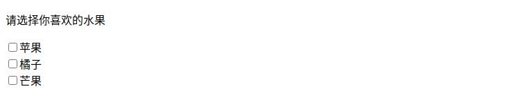
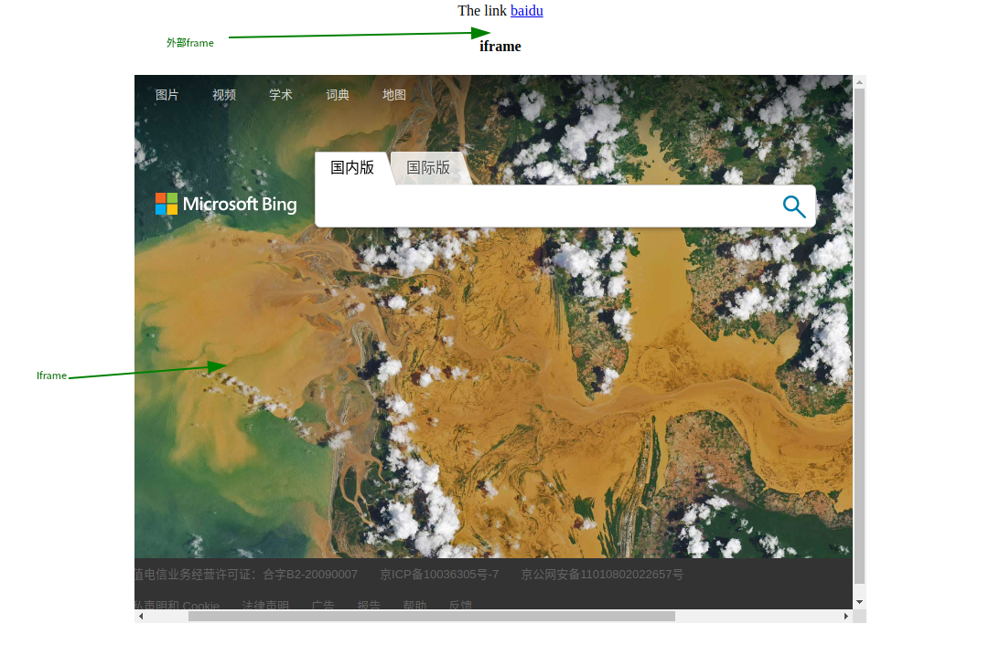

### 操作浏览器的基本方法

#### 获取页面URL地址与标题

WebDriver提供的current_url与title可以获取当前页面的URL地址与标题，这样在实际测试过程中，可以帮助我们校验实际结果是否与期望结果一致

```python
from selenium import webdriver
from time import sleep

driver = webdriver.Firefox()
driver.get("http://cn.bing.com")

print("============The first page============")
# 打印首页title
first_title = driver.title
first_url = driver.current_url
print("the first page title is：%s" % first_title)
print("the first page url is %s" % first_url)

print("============The target page============")
driver.find_element_by_xpath('//a[@id="scpl2"]').click()
sleep(2)
# 打印跳转页title
second_title = driver.title
second_url = driver.current_url
print("the first page title is：%s" % second_title)
print("the first page url is %s" % second_url)

Expect_title = "Bing 学术"
if second_title == Expect_title:
    print(True)
else:
    print(False)

driver.quit()
```

#### 获取浏览器类型

Selenium实现的自动化测试脚本，在实际过程中常常会与CI平台进行集成。当自动化测试程序运行失败时，如果通过测试结果知道自动化程序是在哪种类型的浏览器上运行失败的，则为我们排查问题提供了一个方向

```python
from selenium import webdriver
from time import sleep

driver = webdriver.Firefox()
driver.get('http://cn.bing.com')

# 输出浏览器的类型
print("The Browser is: "+ driver.name)

driver.quit()
```

#### 关闭当前窗口与退出浏览器

```python
# 关闭当前窗口(与窗口切换例子一起展示)
.driver.close()

# 退出浏览器，关闭所有窗口
.driver.quit()
```

#### 元素的操作方法

```python
# send_keys()输入
driver.find_element_by_xpath("//*[@id='sb_form_q']").send_keys("bella")

# click()点击
driver.find_element_by_xpath("//*[@id='sb_form_go']").click()
```

### 元素操作方法

#### 清除元素

```python
# clear()清楚元素中已有的内容
from selenium import webdriver
from time import sleep

driver = webdriver.Firefox()
driver.get('http://cn.bing.com')

driver.find_element_by_xpath('//input[@id="sb_form_q"]').send_keys("星际穿越")
sleep(2)

driver.find_element_by_xpath('//input[@id="sb_form_q"]').clear()
sleep(5)

driver.quit()
```

#### 提交表单

submit()方法用于提交form表单内容或者模拟回车操作，有时可替代click()方法

```python
from selenium import webdriver
from time import sleep

driver = webdriver.Firefox()
driver.get('http://cn.bing.com')

driver.find_element_by_xpath('//input[@id="sb_form_q"]').send_keys("星际穿越")
sleep(2)

# driver.find_element_by_xpath('//input[@type="submit"]').click()
driver.find_element_by_xpath('//input[@id="sb_form_q"]').submit()

sleep(5)

driver.quit()
```

#### 获取元素尺寸

size方法获取元素尺寸

```python
# 获取bing图标尺寸
from selenium import webdriver
from time import sleep

driver = webdriver.Firefox()
driver.get('http://cn.bing.com')

# Bing首页的logo
size = driver.find_element_by_xpath('//*[@id="bLogo"]').size
print(size)

for key,value in size.items():
    print(key+':'+str(value))

driver.quit()

# 结果
{'height': 150.0, 'width': 300.0}
height:150.0
width:300.0
```

#### 获取元素的属性与文本

get_attribute()方法用于获取元素的相关属性

```python
# 获取name属性
from selenium import webdriver
from time import sleep

driver = webdriver.Firefox()
driver.get('http://cn.bing.com')

nameValue = driver.find_element_by_xpath('//input[@id="sb_form_q"]').get_attribute("name")

print(nameValue)

driver.quit()

# 获取text文本内容
from selenium import webdriver
from time import sleep

driver = webdriver.Firefox()
driver.get('http://cn.bing.com')

textValue = driver.find_element_by_xpath('//div[@id="est_cn"]').text

print(textValue)

driver.quit()
```

### 鼠标操作

在自动化测试工程中，可能会遇到页面中的某个元素，需要把鼠标光标移动到该元素上面才能显示出来。当遇到这种情况时，可借助ActionChains类来处理。

在模拟使用鼠标操作时，需要先导入ActionChains类

`from selenium.webdriver.common.action_chains import ActionChains`

ActionChains用于生成用户的行为，可以模拟鼠标操作，如单击、双击、单击鼠标右键、拖曳等。**所有的行为都存储在ActionChains对象中**，再通过perform()方法执行所有Action-Chains对象中存储的行为。

perform()也是ActionChains类提供的方法，通常与ActionChains()配合使用

| 方法                           | 说明                             |
| ------------------------------ | :------------------------------- |
| click(on_element=None)         | 单机鼠标左键                     |
| content_click(on_element=None) | 单机鼠标右键                     |
| double_click(on_element=None)  | 双击鼠标左键                     |
| darg_and_drop(source,target)   | 拖拽到某个元素上然后松开         |
| perform()                      | 执行所有ActionChains中存储的行为 |
| release(on_element=None)       | 在某个元素位置松开鼠标左键       |
| send_keys(*keys_to_send)       | 发送某个键到当前焦点的元素       |

#### 右击操作

context_click()方法是先定位一个元素，然后对定位的元素执行右击。首先要先定位一个元素，其次执行需要的操作，最后需要提交操作

```python
from selenium import webdriver
from selenium.webdriver.common.action_chains import ActionChains
from time import sleep

driver = webdriver.Firefox()
driver.get('http://cn.bing.com')
# 输入框右击
right = driver.find_element_by_xpath('//input[@id="sb_form_q"]')
ActionChains(driver).context_click(right).perform()

sleep(5)

driver.quit()
```

#### 双击操作

```python
from selenium import webdriver
from selenium.webdriver.common.action_chains import ActionChains
from time import sleep

driver = webdriver.Firefox()
driver.get('http://cn.bing.com')

driver.find_element_by_xpath('//input[@id="sb_form_q"]').send_keys('星际穿越')
double = driver.find_element_by_xpath('//input[@id="sb_form_go"]')
ActionChains(driver).double_click(double).perform()

sleep(5)

driver.quit()
```

#### <font color="red">拖动操作（如何释放拖动元素）</font>

drag_and_drop()方法实现元素拖动的功能，即通过鼠标拖曳某个元素到指定的元素后再松开

```python
# 将学术链接元素拖动到搜索框中
from selenium import webdriver
from selenium.webdriver.common.action_chains import ActionChains
from time import sleep

driver = webdriver.Firefox()
driver.get('http://cn.bing.com')

# 定位到学术元素
element = driver.find_element_by_xpath('//a[@id="scpl2"]')

# 定位到搜索框
target = driver.find_element_by_xpath('//input[@id="sb_form_q"]')

ActionChains(driver).drag_and_drop(element,target).perform()

sleep(5)

driver.quit()
```

#### 鼠标指针悬停

通过move_to_element()方法，可以将鼠标指针悬停在一个元素上，从而查看该元素的一些提示信息

```python
from selenium import webdriver
from selenium.webdriver.common.action_chains import ActionChains
from time import sleep

driver = webdriver.Firefox()
driver.get('http://cn.bing.com')

# 定位到搜索框
element = driver.find_element_by_xpath('//input[@id="sb_form_q"]')

ActionChains(driver).move_to_element(element).perform()

sleep(5)

driver.quit()
```

### 键盘操作

除了鼠标操作外，我们在操作浏览器的过程中还会用到一些键盘操作事件，例如按键盘回车键、回退键，通过键盘进行复制、粘贴等操作

Selenium提供了比较完整的键盘操作，同样的，在模拟键盘操作之前也需要导入Keys类

`from selenium.webdriver.common.keys import Keys`

常用键盘操作

| 引用方法                    | 对应键盘                |
| --------------------------- | ----------------------- |
| send_keys(Keys.BACK_SPACE)  | 删除键（BackSpace）     |
| send_keys(Keys.SPACE)       | 空格键（Space）         |
| send_keys(Keys.TAB)         | 制表符（Tab）           |
| send_keys(Keys.ALTERNATE)   | 换挡键（Alt）           |
| send_keys(Keys.ENTER)       | 回车键（Enter）         |
| send_keys(Keys.SHIFT)       | 大小写转换键（Shift）   |
| send_keys(Keys.CONTROL,'a') | 全选（Ctrl+A）          |
| send_keys(Keys.CONTROL,'b') | 复制（Ctrl+C）          |
| send_keys(Keys.CONTROL,'x') | 剪切（Ctrl+X）          |
| send_keys(Keys.CONTROL,'v') | 粘贴（Ctrl+V）          |
| send_keys(Keys.F1)          | F1键                    |
| send_keys(Keys.F12)         | F12键                   |
| send_keys(Keys.PAGE_UP)     | 向上翻页键（Page Up）   |
| send_keys(Keys.PAGE_DOWN)   | 向下翻页键（Page Down） |
| send_keys(Keys.LEFT)        | 向左方向键（Left）      |
| send_keys(Keys.RIGHT)       | 向右方向键（Right）     |
| send_keys(Keys.ESCAPE)      | 回退键（Esc）           |

```python
# 常见键盘操作
from selenium import webdriver
from time import sleep
from selenium.webdriver.common.keys import Keys

driver = webdriver.Firefox()
driver.get("http://cn.bing.com")

sleep(2)
driver.find_element_by_id("sb_form_q").send_keys("火星救援")
sleep(2)

# 输入删除键
driver.find_element_by_id("sb_form_q").send_keys(Keys.BACK_SPACE)
sleep(2)

driver.find_element_by_id("sb_form_q").send_keys("降临")
sleep(2)

# 全选
driver.find_element_by_id("sb_form_q").send_keys(Keys.CONTROL,'A')
sleep(2)
# 剪切
driver.find_element_by_id("sb_form_q").send_keys(Keys.CONTROL,'X')
sleep(2)
# 粘贴
driver.find_element_by_id("sb_form_q").send_keys(Keys.CONTROL,'V')
sleep(2)
# 复制
driver.find_element_by_id("sb_form_q").send_keys(Keys.CONTROL,'C')
sleep(2)
driver.find_element_by_id("sb_form_q").send_keys(Keys.CONTROL,'V')
sleep(2)
# Enter
driver.find_element_by_id("sb_form_q").send_keys(Keys.ENTER)
sleep(2)
driver.close()
sleep(2)
driver.quit()
```

### 定位一组元素

WebDriver有8种定位单个元素的方法，以及与之对应的用于定位一组元素的8种方法

1. 通过tag name定位一组元素



```html
<!DOCTYPE html>
<html lang="en">
<head>
    <meta charset="UTF-8">
    <title>复选框测试实例</title>
</head>
<body>
    <p>请选择你喜欢的水果</p>
    <input type="checkbox" name="fruit" value="apple">苹果<br>
    <input type="checkbox" name="fruit" value="orange">橘子<br>
    <input type="checkbox" name="fruit" value="mango">芒果<br>
</body>
</html>
```

```python
from selenium import webdriver
from time import sleep

driver = webdriver.Firefox()
driver.get('file:///home/william/DYJ/software-test/21.Selenium/html/checkbox.html')

#inputs = driver.find_elements_by_tag_name("input")
inputs = driver.find_elements_by_xpath("//*[@name='fruit']")

for i in inputs:
    if i.get_attribute("type") == "checkbox":
    # if i.get_attribute("name") == "fruit":
        i.click()
        sleep(1)

driver.quit()
```

2. 层级定位

   如果被定位的元素无法通过自身属性来唯一标识自己，此时可以考虑借助上级元素来定位自己。举个生活中的例子，一个婴儿刚出生时还没有姓名与身份证号，此时给婴儿进行检查时往往会标注为“某某之女”。因为婴儿的母亲是确定的，找到母亲也就找到了婴儿。

   XPath的层级与属性结合定位的原理也是如此。

   在定位一组元素时，也可以用层级定位的方法。例如常见的表格、下拉列表框等，都可能用到层级定位。

   | 省份 | 城市 |
   | ---- | ---- |
   | 辽宁 | 沈阳 |
   | 吉林 | 长春 |

   国籍	中国↓

   ```html
   <!DOCTYPE html>
   <html lang="en">
   <head>
       <meta charset="UTF-8">
       <title>表格&下拉列表</title>
       <style>
           .box{
               width: 500px;
               height: 800px;
               margin: 20px auto;
               text-align: center;
           }
           #qw{
               border: 1px;
               text-align: center;
           }
       </style>
   </head>
   <body>
       <table id="qw">
           <tr>
               <th>省份</th>
               <th>城市</th>
           </tr>
           <tr>
               <td>辽宁</td>
               <td>沈阳</td>
           </tr>
           <tr>
               <td>吉林</td>
               <td>长春</td>
           </tr>
       </table>
       <br>
       <div class="box">
           <label for="">籍贯</label>
           <select name="site" id="">
               <option value="0">英国</option>
               <option value="1">德国</option>
               <option value="2">中国</option>
           </select>
       </div>
   </body>
   </html>
   ```

   ```python
   # 通过层级定位方式获取表格“吉林”这个单元格的值
   # 在“国籍”下拉列表框中选择“中国”
   
   from selenium import webdriver
   from time import sleep
   
   driver = webdriver.Firefox()
   driver.get('file:///home/william/DYJ/software-test/21.Selenium/html/table.html')
   
   table = driver.find_element_by_id("qw")
   
   # 获取行
   row = table.find_elements_by_tag_name("tr")
   
   # 获取列数
   col = row[0].find_elements_by_tag_name("th")
   
   # 获取第一行第一列的值
   Row_Col = row[1].find_elements_by_tag_name("td")[0].text
   
   print(Row_Col)
   
   # 在下拉列表框中选择第二个值
   checkvalue = driver.find_element_by_name("site")
   checkvalue.find_element_by_xpath('//option[@value="2"]').click()
   
   sleep(2)
   
   driver.quit()
   ```

### 等待时间

有时有些元素还没加载出来脚本就对其进行操作了，这样必然是无法成功的，所以需要加入等待时间，尽量不因为元素没加载出来而报错。

自动化测试过程中必然会遇到环境不稳定、网络加载缓慢等情况。当定位没有问题，但程序运行时却报出元素不存在（不可见）的错误时，就需要思考是否是因为程序运行太快或者页面加载太慢而造成了元素不可见，此时就必须设置等待时间，直到元素可见后再继续运行程序。

当UI自动化页面元素不存在时，常见的发生异常的原因有如下几点：

- 页面加载时间过慢，需要查找的元素代码已经执行完成，但是页面还未加载成功，从而发生异常；
- 查到的元素没有在当前的iframe或者frame中，此时需要切换至对应的iframe或者frame中；
- 代码中对元素的描述错误

#### 强制等待

强制等待也叫作固定休眠时间，是设置等待的最简单的方法，如sleep(5)，其中5的单位为s

sleep(*)不管什么情况代码运行到它所在的位置时，都会让脚本暂停运行一定时间（如sleep(5)为暂停5s），时间到达后再继续运行。

sleep()的缺点是不够智能，如果设置的时间太短，而元素还没有加载出来，代码照样会报错；如果设置的时间太长，则又会浪费时间。不要忽视每次几秒的时间，当用例多了，代码量大了，多几秒就会影响脚本的整体运行速度，所以应尽量少用强制等待sleep()（至少生产环境中尽量避免使用）

```python
from selenium import webdriver
from time import sleep

driver = webdriver.Chrome()
driver.get('https://cn.bing.com')

driver.find_element_by_xpath('//input[@id="sb_form_q"]').send_keys('豆瓣')
driver.find_element_by_xpath('//input[@id="sb_form_go"]').click()

# 强制等待
sleep(5)

driver.quit()
```

#### 隐式等待

隐式等待也叫作智能等待（implicitly_wait(xx)），当设置了一段时间后，在这段时间内如果页面完成加载，则进行下一步，如果未加载完，则会报超时错误。

设置隐式等待（implicitly_wait()）后，如果整个页面很快加载完毕，而因为程序代码中对元素的描述属性不正确，造成不能在页面中很快找到该元素时，代码会根据隐式等待时设置的一个最长等待时间（如implicitly_wait(10)，最长等待时间等于10s），不断地尝试查找元素，直到超过最长等待时间（10s）后才会抛出异常，告知找不到该元素。因此，隐式等待中的最长等待时间也可理解为查找元素的最长时间。隐式等待（implicitly_wait()）也是存在缺点的。

**隐式等待是设置了一个最长等待时间（implicitly_wait(10)，最长等待时间等于10s），如果在规定时间内（10s以内）网页很快加载完成（如5s），则执行下一步，否则一直等到时间（10s）截止，然后才执行下一步。**这里就存在弊端了，例如有时程序代码中想要操作的页面中的某个元素早就加载完成了，但是显示过程中如JS等代码加载特别慢，整个网页还处在加载过程中，那么程序代码会一直等待整个页面加载完成才会执行下一步。下面以Bing搜索页为例来理解隐式等待implicitly_wait()的应用，代码如下：

```python
from selenium import webdriver
from selenium.common.exceptions import NoSuchElementException
from time import sleep,ctime

driver = webdriver.Firefox()

# implicitly_wait隐式等待
# 判断某元素，如果超过10s未发现，则抛出错误
# 如果在5s内页面家在完毕，则对该元素进行操作

driver.implicitly_wait(10)
driver.get("https://cn.bing.com")

try:
    # 输出第一个时间
    print(ctime())

    # driver.find_element_by_xpath('//input[@id="sb_form_q"]').send_keys("星际穿越")
    # driver.find_element_by_xpath('//input[@id="sb_form_go"]').click()

    # 输入错误xpath，检查是否等待10s
    driver.find_element_by_xpath('//input[@id="sb_form_q"]').send_keys("星际穿越")
    driver.find_element_by_xpath('//input[@id="sb_form_gog"]').click()

except NoSuchElementException as e:
    
    print(e)

finally:
    # 输出第一个时间，观察间隔
    print(ctime())
    driver.quit()
```

```shell
[william@william-pc ~]$ python /home/william/DYJ/software-test/21.Selenium/Untitled-1.py
Mon Mar 22 23:15:56 2021
Message: Unable to locate element: //input[@id="sb_form_gog"]

Mon Mar 22 23:16:06 2021

[william@william-pc ~]$ python /home/william/DYJ/software-test/21.Selenium/Untitled-1.py
Mon Mar 22 23:16:36 2021
Mon Mar 22 23:16:37 2021
```

#### 显示等待

显式等待（WebDriverWait）配合该类的until()和until_not()方法，能够根据判断条件进行灵活地等待。它的执行原理是：程序每隔多长时间检查一次，如果条件成立了，则执行下一步，否则继续等待，直到超过设置的最长时间，然后抛出TimeoutException。

WebDriverWait等待也是我们推荐的方法。在使用WebDriverWait方法前需要导入该方法。使用WebDriverWait方法时常常会结合expected_conditions模块一起使用。

结合前面的Bing搜索测试场景，等搜索框元素在DOM树中被加载后再对搜索框元素完成赋值操作

```python
from selenium import webdriver
from selenium.webdriver.common.by import By
from selenium.webdriver.support.ui import WebDriverWait
from selenium.webdriver.support import expected_conditions as EC
from time import sleep,ctime

driver = webdriver.Firefox()
driver.get("https://cn.bing.com")

# 每隔0.5秒检查一次，超过5秒未找到id为sb_form_q,则抛出TimeoutException
element = WebDriverWait(driver,5,0.5).until(EC.presence_of_element_located
((By.ID,"sb_form_q")))
element.send_keys("星际穿越")

driver.quit()
```

WebDriverWait方法：

- .dirver：传入WebDriver实例
- .timeout：超时时间，即等待最长时间（同时要考虑隐式等待时间）
- .poll_frequency：调用until或until_not中的方法间隔时间，默认是0.5秒
- .ignored_exceptions：忽略的异常。如果在调用until或until_not的过程中抛出这个元组中的异常，则不中断代码，继续等待；如果抛出的是这个元组外的异常，则中断代码，抛出异常。默认只有NoSuchElementException

**WebDriverWait需要与unitl()或者until_not()方法结合使用**

调用该方法提供的驱动程序作为参数，直到返回值为True 

`WebDriverWati(driver,5).until(method,message = "")`

- ·method：在等待期间，每隔一段时间调用这个传入的方法，直到返回值不是False
- ·message：如果超时，抛出TimeoutException，将message传入异常

调用该方法提供的驱动程序作为参数，直到返回值为False

`WebDriverWati(driver,5).until_not(method,message = "")`

·until_not与until相反，until是当某元素出现或某个条件成立则继续执行，until_not是当某元素消失或某个条件不成立则继续执行，两者参数相同。

expected_conditions是Selenium的一个模块，其中包含一系列可用于判断的条件。expected_conditions模块包含十几个condition，与until、until_not组合能够实现很多判断，如果将其灵活封装，可以大大提高脚本的稳定性。

- ·title_is：判断当前页面的标题是否完全等于预期字符串，返回布尔值。
- ·title_contains：判断当前页面的标题是否包含预期字符串，返回布尔值。
- ·presence_of_element_located：判断某个元素是否被加到了DOM树里，并不代表该元素一定可见。
- ·visibility_of_element_located：判断某个元素是否可见。可见代表元素非隐藏，并且元素的宽和高都不等于0。
- ·visibility_of：跟前面的几个方法做一样的事情，只是前面的方法要传入locator，而该方法直接传定位到的element即可。
- ·presence_of_all_elements_located：判断是否至少有一个元素存在于DOM树中。例如，如果页面上有n个元素的class都是'b_searchbox'，那么只要有一个元素存在，这个方法就返回True。
- ·text_to_be_present_in_element：判断某个元素中的text是否包含预期的字符串。
- ·text_to_be_present_in_element_value：判断某个元素中的value属性是否包含预期的字符串。·frame_to_be_available_and_switch_to_it：判断该frame是否可以切换（switch）进Frame，如果可以的话则返回True并且切换进去，否则返回False。
- ·invisibility_of_element_located：判断某个元素是否不存在于DOM树中或不可见。
- ·element_to_be_clickable：判断某个元素是否可见并且是可以单击的。
- ·staleness_of：当某个元素从DOM树中移除后，返回True或False。
- ·element_to_be_selected：判断某个元素是否被选中了，一般用在下拉列表框中。
- ·element_selection_state_to_be：判断某个元素的选中状态是否符合预期。
- ·element_located_selection_state_to_be：跟前面的方法作用一样，只是前面的方法传入定位到的element，而该方法传入locator。·alert_is_present：判断页面上是否存在alert。

```python
from selenium import webdriver
from selenium.webdriver.common.by import By
from selenium.webdriver.support.ui import WebDriverWait
from selenium.webdriver.support import expected_conditions as EC
from time import sleep,ctime

# 隐式等待和显式等待是可以结合

driver = webdriver.Firefox()

# 隐式等待
driver.implicitly_wait(20)

driver.get("https://cn.bing.com")

try:
    # 显示等待
    WebDriverWait(driver,10,0.5).until(EC.presence_of_element_located((By.NAME,"q")))
    
    driver.find_element_by_xpath('//input[@name="q"]').send_keys("星际穿越")
finally:
    driver.quit()
```

设置了隐式等待和显式等待，在其他操作中，隐式等待起决定性作用，而在WebDriverWait中，显式等待起主要作用。需要注意的是，最长的等待时间取决于两者之间的大者，此例中为20，隐式等待时间大于显式等待时间，则该代码的最长等待时间等于隐式等待设置的时间。

### Frame切换

我们在使用Selenium定位页面元素的时候，有时会遇到定位不到的问题，在页面上可以看到元素，用浏览器的开发者工具也能够看到，而代码运行就是定位不到。当遇到这种情况时，很有可能是有Frame存在。

Frame标签有Frameset、Frame和IFrame 3种，Frameset跟其他普通标签没有区别，不会影响到正常的定位。在页面中我们经常能看到Frame或IFrame（Frame是整个页面的框架，IFrame是内嵌的框架），由于WebDriver定位元素时只能在一个页面上定位，所以对于IFrame这样的情况，WebDriver是无法直接定位到元素的。

Selenium中有对应的方法对Frame进行操作。

WebDriver提供了switch_to.frame()方法来切换Frame  `switch_to.frame(reference)`



```html
<!DOCTYPE html>
<html lang="en">
<head>
    <meta charset="UTF-8">
    <title>Document</title>

</head>
<body>
    <div class="alert" align="center">The link
        <a href="alert-link" href="https://www.baidu.com">baidu</a>
    </div>
    <div class="row-fluid">
        <div class="span-ifrme" align="center">
            <h4 align="center">iframe</h4>
                <iframe id="iname" name="nf" src="https://www.baidu.com" frameborder="0" width="800" height="600">
                </iframe>
        </div>
    </div>
</body>
</html>
```

```python
# 单击Bing搜索页的搜索框完成关键字的搜索


```


selenium第二次作业：
对于css绝对路径各写3个demo，xpath和css的相对路径各写15个demo代码，涵盖我讲的每种用法。
特殊api场景处理，需要每个先xmind或者word进行整理，理清楚使用的内容以及每个api要通过代码实现输出。

```python
//div[@class='schbox']/form/input[1]

利剑 2021-3-21 9:30:37
//div[@class='small_cart']/a/div/span

利剑 2021-3-21 9:31:54
//input[@class='but1']

利剑 2021-3-21 9:32:49
//input[@placeholder='请输入你要查找的关键字']

利剑 2021-3-21 9:34:45
//input[@name='key' and @class='but1']

利剑 2021-3-21 9:35:19
//input[@name='key' and @class='but1' and @type='text']

利剑 2021-3-21 9:37:17
//*[@name='key' and @class='but1' and @type='text']

利剑 2021-3-21 9:39:32
//a[text()='免费注册']

利剑 2021-3-21 9:41:38
//input[contains(@placeholder,'请输入')]

利剑 2021-3-21 9:44:45
driver.find_element_by_xpath('//input[contains(@placeholder,"请输入")]')

利剑 2021-3-21 9:48:33
//input[@class='but1']/..

利剑 2021-3-21 9:52:25
css选择器

利剑 2021-3-21 9:54:49
html>body>div>div>div>div>form>input

利剑 2021-3-21 9:57:19
i#cart_num

利剑 2021-3-21 9:58:59
input.but1

利剑 2021-3-21 10:00:32
input[placeholder='请输入你要查找的关键字']

利剑 2021-3-21 10:01:46
input[class='but1']

利剑 2021-3-21 10:03:09
div[class='schbox']>form>input:nth-child(1)

利剑 2021-3-21 10:04:35
div.schbox>form>input:nth-child(1)

利剑 2021-3-21 10:05:57
input[name='key'][placeholder='请输入你要查找的关键字'][type='text']

利剑 2021-3-21 10:06:55
div.schbox>form>input:first-child

利剑 2021-3-21 10:07:29
div.schbox>form>input:last-child

利剑 2021-3-21 10:08:28
div.schbox>form>input:nth-last-child(2)

利剑 2021-3-21 10:13:17
driver.find_element_by_css_selector("i#cart_num").click()

driver.find_element_by_tag_name()

aa = driver.find_elements_by_tag_name("input")
aa[98].click()

利剑 2021-3-21 10:41:44
title = driver.title

利剑 2021-3-21 10:43:16
url = driver.current_url

利剑 2021-3-21 10:48:50
driver.refresh()

利剑 2021-3-21 10:49:37
driver.back()

利剑 2021-3-21 10:49:47
driver.forward()

利剑 2021-3-21 10:55:08
driver.set_window_size(1200,800)

利剑 2021-3-21 10:56:37
driver.maximize_window()

利剑 2021-3-21 10:59:35
.clear()

利剑 2021-3-21 11:00:25
.click()

利剑 2021-3-21 11:08:57
size = driver.find_element_by_xpath("//div[@class='schbox']/form/input").size
print(type(size))
print(size)
print(size['height'])

利剑 2021-3-21 11:11:13
text = driver.find_element_by_css_selector('div.schhot>a').text

利剑 2021-3-21 11:13:48
inputButton = driver.find_element_by_xpath("//div[@class='schbox']/form/input").get_attribute('placeholder')

利剑 2021-3-21 11:16:40
dis = driver.find_element_by_xpath("//div[@class='schbox']/form/input").is_displayed()

利剑 2021-3-21 11:17:53
回显

利剑 2021-3-21 11:18:42
.get_attribute('value')

利剑 2021-3-21 11:23:41
from selenium.webdriver.common.action_chains import ActionChains

利剑 2021-3-21 11:30:34
ele = driver.find_element_by_link_text('母婴玩具')
time.sleep(4)

ActionChains(driver).move_to_element(ele).perform()

利剑 2021-3-21 11:32:14
ActionChains(driver).context_click(ele).perform()
ActionChains(driver).double_click(ele).perform()

source = driver.find_element_by_xpath("sdf")
target = driver.find_element_by_xpath("")
ActionChains(driver).drag_and_drop(source,target)

ActionChains(driver).drag_and_drop_by_offset(source,100,0)

利剑 2021-3-21 11:52:53
driver.find_element_by_xpath("//div[@class='schbox']/form/input").send_keys(Keys.CONTROL,'a')

利剑 2021-3-21 11:53:00
driver.find_element_by_xpath("//div[@class='schbox']/form/input").send_keys(Keys.BACK_SPACE)

利剑 2021-3-21 11:53:11
from selenium.webdriver.common.keys import Keys

利剑 2021-3-21 14:22:55
from selenium.webdriver.support.ui import WebDriverWait
from selenium.webdriver.common.by import By
from selenium.webdriver.support import expected_conditions as EC

利剑 2021-3-21 14:32:31
ele = WebDriverWait(driver,15,0.5).until_not(EC.presence_of_element_located(
	(By.XPATH,"//div[@class='schbox']/form/input[1]")))

利剑 2021-3-21 14:34:38
焦点 句柄

利剑 2021-3-21 14:37:17
print(driver.window_handles)

利剑 2021-3-21 14:38:22
print (driver.current_window_handle)

driver.switch_to.window(driver.window_handles[1])

利剑 2021-3-21 14:44:52
driver.close()

利剑 2021-3-21 14:45:36
driver.quit()

利剑 2021-3-21 14:54:22
driver.switch_to.alert.send_keys("test")

利剑 2021-3-21 14:54:50
print (driver.switch_to.alert.text)

利剑 2021-3-21 14:55:14
driver.switch_to.alert.accept()

利剑 2021-3-21 14:55:24
driver.switch_to.alert.dismiss()

利剑 2021-3-21 15:04:56
driver.get_screenshot_as_file("E:/newCourselenium/test.png")

利剑 2021-3-21 15:14:37
driver.switch_to.frame('x-URS-iframe')#有id,name

利剑 2021-3-21 15:20:51
dd = driver.find_element_by_xpath("//div[@id='loginDiv']/iframe")
driver.switch_to.frame(dd)

driver.switch_to.parent_frame()#从子frame切回到父frame
driver.switch_to.default_content()#切回主文档

利剑 2021-3-21 15:37:32
from selenium.webdriver.support.select import Select

利剑 2021-3-21 15:40:04
s = driver.find_element_by_id("J_roomCountList")
Select(s).select_by_visible_text("2间")

利剑 2021-3-21 15:41:15
Select(s).select_by_index(3)

利剑 2021-3-21 15:42:11
Select(s).select_by_value("5")

利剑 2021-3-21 15:55:37
js = "document.getElementById('noticeEndTime').removeAttribute('readonly')"

利剑 2021-3-21 15:55:43
d.find_element_by_name("noticeEndTime").send_keys("2019-06-12 10:52:52")

利剑 2021-3-21 15:55:50
d.execute_script(js)

利剑 2021-3-21 15:58:24
js = "document.getElementsByName('noticeEndTime')[0].removeAttribute('readonly')"

利剑 2021-3-21 15:59:29
js = "document.getElementsByTagName('input')[0].removeAttribute('readonly')"

利剑 2021-3-21 16:04:31
js="var q=document.documentElement.scrollTop=10000"
driver.execute_script(js)

利剑 2021-3-21 16:04:42
js="var q=document.documentElement.scrollTop=0"

利剑 2021-3-21 16:06:25
driver.execute_script("window.scrollTo(0, document.body.scrollHeight*0.5)");

利剑 2021-3-21 16:09:14
driver.execute_script("window.scrollBy(0,200)");

selenium自动化测试之--验证码处理
http://www.bcbxhome.com/bcbxxy/forum.php?mod=viewthread&tid=295
(出处: 编测编学学院_西安软件测试培训_软件测试培训机构)
```

