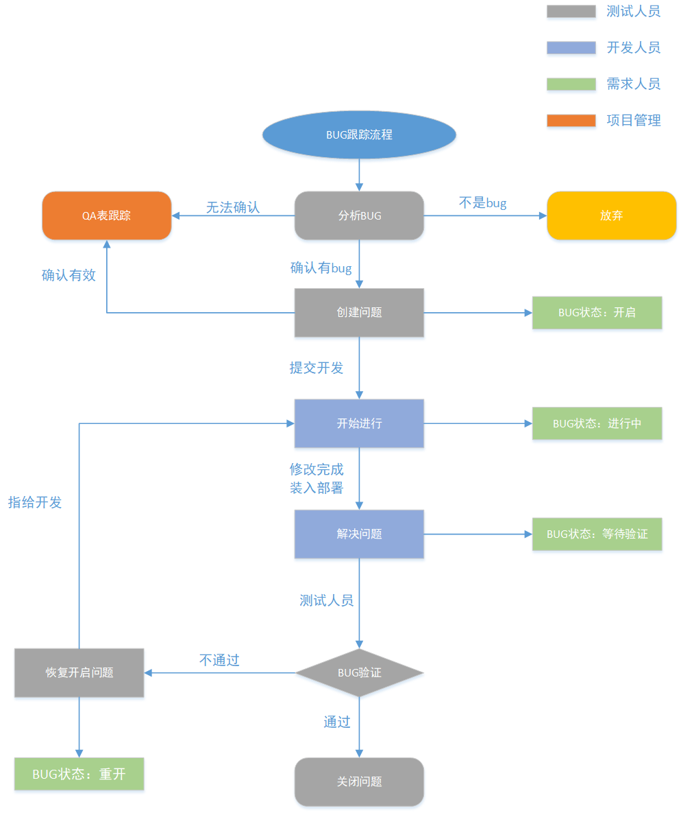

## BUG概念讲解

BUG的分类

#### 1.对bug的划分，禅道为例，包括：

1. 功能缺陷（业务流程未实现）
2. 代码错误（错误页404、500）
3. 界面优化（UI问题，图文显示）
4. 安装部署（安装失败，无法访问等）
5. 性能问题（响应时间久，加载慢）
6. 安全相关（密码：12345\*****）
7. 其他划分（易用性类、兼容性类）
8. 设计缺陷（需求问题）

#### 2. BUG严重程度

1.致命的——最高

2.严重的——高

3.一般的——中

4.轻微的——低

5.建议性——低

1. 系统崩溃（请求直接把服务器搞坏）、死机、死循环，导致数据库数据丢失，与数据库连接错误，主要功能丧失，重要的一级菜单功能不能使用等

2. 系统主要功能部分丧失、数据库保存，提交调用错误，功能设计与需求严重不符，自动退出，稳定性差，数值计算统计错误等（该等级问题出现在不影响其他功能测试的情况下可以继续该版本测试）
3. 功能菜单没有完全实现存在缺陷，但不会影响系统稳定性。如：操作时间长、查询时间长、格式错误、边界条件错误，删除没有确认框、数据库表中字段过多等（该问题实际测试中存在最多）10个字段11--12  13--
4. 兼容性，界面优化，不影响操作功能的执行，错别字，页面显示重叠，提示语丢失（此类问题在测试初期较多，优先程度低）登录、登陆

#### BUG优先级

非常紧急

紧急

一般

不重要

#### BUG的状态标准

1. 待处理（提交——激活）

   测试人员或用户发现新问题提交的状态

2. 已确认

   经测试人员及研发人员讨论后确认是BUG，提交的状态，由**开发点确认按钮**

3. 已处理=已解决

   经研发人员确认是BUG后修复的状态，修改还没有验证，由**开发人员来设置**

4. 已修改=已关闭——最终

   测试人员认为问题已经修改，**通过验证**，由**测试人员设置**

5. 仍存在=重新打开

   测试人员认为BUG未修复成功，问题仍然存在，由**测试人员设置**

6. 不是BUG

   研发人员确认不是BUG，或者建议与意见决定不采纳，由**开发人员设置**

7. 暂不处理=挂起

   当前版本不做修改，后续版本再考虑，或者一时不确定是解决不解决，需要过一两天来决定，这样的BUG就需要一个**挂起**状态由**研发人员或测试人员设置**

